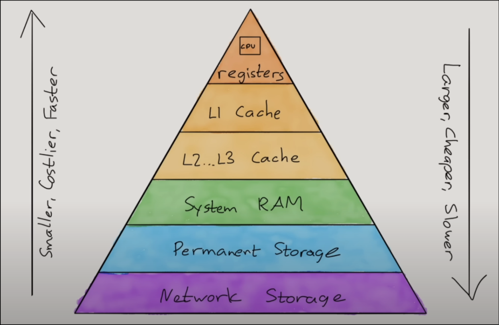

# Topic 2 - Computer Organisation

> [!IMPORTANT]
> "In addition" paragraphs or 'NOTE' are knowledges not taught in the IBDP and most likely never going to appear in any questions.<br>

First thing first, learn these few terms:

- *High level* means something that's closer to human, while *low level* means something closer to machine.
- 'Programs' might be interchangeable with 'processes', although the former has more frequent use in IB environment.
- Denary, also called base-10 or decimal, is the numerical system that human use. A denary digit is able to represent 10 integers using the number 0 to 9.

## Computer Architecture

Computer architecture is the structure of a computer system made from component parts, defining how it components interact with each other.
Each architecture has its own *instruction set* (for the CPU), design and organization of compenents, and logic design (electronics circuits).

### CPU

The "brain" of the computer.
It process all instruction from processes and peripheral, one by one at *mega turbo blazingly* fast rate, which include arithmetics, logical, or input/output operations.

> In addition,<br>
> As you see later, data are stored in memory addresses, including functions (imagine it like small input/output programs or algorithm), read-only data (on the .rodata section), and the variables in you code.
> These instructions mostly use the CPU registers to manipulate bytes in memory addresses (arithmetics), calling functions (using memory address), pushing and popping the stack memory, and jumping instruction pointer (logical operations).

#### Von Neumann Model

CPU in real life is complex, and this is the simplified diagram of the CPU, just the things you need to know. In short, instruction travel in this order:<br>

1. <details>
   <summary>Program Counter (PC) -> A Memory Address</summary>
   Goes through all memory address section at RAM of a program and executes these instructions. It's pointing at a instruction and send the memory address to MAR, then going to the next instruction.<br>

   > In addition,<br>
   > PC may jumps to another memory addresses in the RAM during logical operations.
   For example, when during a comparison variable X is less than 10, the program add one to it, then jump back again to the comparison. If not less than 10, the PC skip the jump to the comparison by jumping to the instruction after it, thus escaping the loop.<br>
   Less clear example, during iteration of an array, a match is found (i.e X - Y == 0) , the PC jumps ahead a few memory address, escaping of the loop instruction just after the comparison.<br>
   </details>
2. <details>
   <summary>Memory Address Registers (MAR) -> A Memory Address</summary>
   MAR store memory addresses to be read or writen. It send the memory address given by PC to RAM throught the Address Bus.
   </details>
3. <details>
   <summary>Random Access Memory (RAM) -> Data</summary>
   RAM access the data in the memory address given by MAR, and sending it to MDR through the data bus.
   </details>
4. <details>
   <summary>Memory Data Registers (MDR) -> Data</summary>
   MDR acts as a buffer, temporarily store data read or written from RAM. Send the data given by the RAM to the CU/CIR through the data bus.
   </details>
5. <details>
   <summary>Control Unit/Current Instruction Registers (CU/CIR) -> Instruction</summary>
   The data given by MDR is stored in CIR. The CU then decode the data into an instruction, then send it to ALU/ACC.

   > In addition,<br>
   > These 'data' are *just* numbers that map to a particular instruction based on the architecture's instruction set.
   </details>
6. <details>
   <summary>Arithmetic Logic Unit/Accumulator (ALU/ACC) -> Output</summary>
   Execute the instruction from CU and output the result it. The ACC keps data between calculation.
   </details>

#### Fetch-Decode-Execute Cycle (FDE Cycle)

Also called the machine instruction cycle. Fetch stand for step 1-4, decode for step 5, and execute for step 6.<br>
This cycle is orchestrated by the CU.

> ![NOTE]
> A 'core' means an ALU.<br>
> Processor speed is the amount of FDE cycle per second.

### Primary Memory

#### RAM

Random Access Memory.<br>
When electricity is ceased, the data in the RAM will be lost; short term memory, also called 'volatile'.
Its main purpose is to store and retrieve data from a memory address.

#### ROM

Read-Only Memory.<br>
Used to store permanent data and instructions, such as the BIOS to boot the computer.
It's written by the factory and keep data without electricity.

> [!NOTE]
> In addition, It include the splash screen (logo) you see when you boot up.

#### Cache

Stores frequently used instructions.<br>
The CPU check instrucition in the cache first as it's closer than RAM.
Cache has 3 'Level', nicknamed L1/L2/L3, with L1 being the fastest. L1 cache is located in the CPU itself.

### Secondary Memory

Long-term and persistent memory/storage, keeps data without electricity.
It hold data that are not in use, e.g old PDFs, your photos, and other things not curretnly read/writen.
Programs are stored in secondary memory until they're executed, where the program moves to the RAM.
Fetching data from secondary memory is slow as it's not direcly connected to the CPU, althought it's usually has way larger capacity than RAM.
Secondary memory devices include:

- Hard drive.

### Virtual Memory

A mechanism that allow computer to use more memory than there's physically available in RAM, by transferring pages of memory the secondary storage devices.
Its slower than RAM, and is temporary.
When the RAM has available spaces, it moves back the pages of memory to the RAM.

> [!NOTE]
> OS' memory management (you'll learn this later) is able to maps *virtual memory addresses* used by a program into physical addresses in computer (secondary) memory.

### Comparison of Memory Devices



## Operation System

An Operating System (OS) is a software manages all other software and hardware components and resources for processes/programs.
It acts as an intermediary between the user and the computer hardware, allowing the user to interact with the computer and perform various tasks.
**OS has 5 roles**:

### User Interface

Provide way for the user to interacts with the computer. In IBDP Computer Science, OS defined to has 4 types of UI:

- Graphical User Interface (GUI)
  Menus, icons, point & click.
- Command Line Interface (CLI)
  You type commands to interact with the system. It's hella cool!
- Natural Language Interface (NLI)
  Use user voice to interact with the system.
- Menu Based Interface (MBI)
  Similar to CLI, but only menu options; limited, it sucks!

### Memory Management

Controlling and coordinating computer memory.
It assign portions known as blocks (of memories) to programs in an optimized way, and managing the mapping the logical addresses to physical addresses of said programs.
It organize memory locations (e.g folders/directories) and sort data for efficiency.
OS also manages the copying and deleting of files.

### Peripheral Management

By coordinating with the BIOS, OS manage peripherals (mouse, keyboards, speakers).
For a peripheral to work, it uses drivers that translate peripheral signals to machine codes and vice versa.

### Multitasking

CPU can only execute one instruction at a given time.
OS allocates CPU cycles to concurrent programs based on priority and time, giving the illusion of paraller running program.
Each programs are given turn to use the CPU.

### Security

Manage users and groups with controlled/limited privileges, which needs password (usually) to authenticate as.<br>
Limited privilege as in users not being able to tamper with critical system files.

## Application Software

Make sure to remember 2 or 3 of these for the exams. There are multiple types of softwares:

- <details><summary>Word Processors</summary>
  Creating, storing, and printing text documents.<br>
  There was a question about 'how do autocorrect works in words processor', and the answer relate with the FDE Cycle.<br>
  Basically, a word is compared against dictionary/ies stored in the RAM, and if there's no exact match, then it's a word error.
  </details>
- <details><summary>Spreadsheets</summary>
  For computation, organization, analysis, and storage of data in tabular form, being the digital version of a paper-based worksheet, where data is arranged in rows and columns, and each cell may contain either numeric or text data, or the results of formulas that automatically calculate and display a value based on the contents of other cells.
  </details>
- <details><summary>Database Management System (DBMS)</summary>
  Computerized data-keeping system.<br>
  Users are facilitated to perform data manipulation (CRUD) or structure management of a database while providing security, privacy, and reliability.
  </details>
- <details><summary>Email Client</summary>
  Provides users with a user interface that allows them to access, manage, and send emails.<br>
  Can be either in the form of standalone applications, web-based applications, or mobile applications.
  </details>
- <details><summary>Web Browser</summary>
  Access, navigate, render, and interact with websites on the internet through HTTP/S protocol by clicking on links or entering text.<br>
  The most popular web browsers are Google Chrome, Apple Safari, Mozilla Firefox, and Microsoft Edge.
  </details>
- <details><summary>Computer Aided Design (CAD)</summary>
  Computers (or workstations) aiding the creation, modification, analysis, documentation, or optimization of a design.<br>
  It create a database for manufacturing, with outputs in the form of electronic files.<br>
  Specifically, CAD/CAM (computer-aided design/computer-aided manufacturing) is used to design products such as electronic circuit boards in computers and other devices.
  </details>
- <details><summary>Graphic Processing Software (Photoshop)</summary>
  Enable a person to manipulate images or models visually on a computer.
  </details>

## Data Representation

### Binary

Data in computer is represented in the form of bits, binary, or base-2 numerical system.<br>
It only use 1 and 0 to represent a number.
The max number of integers an X amount of bit can represent is $2^X$.

> [!NOTE]
> An ASCII character (e.g 'A') is a byte long; Every UTF-8 letter is a byte long;<br>
> That said, you can be sure that the word "Computer" is 8 bytes long.<br>
> In addition, the IB doesn't teach you the *two's complements*, which teach how negative number is represented.

<details><summary>Table of bit units</summary>

| 1 Byte     | 8 Bits         |
| ---------- | -------------- |
| 1 Kilobyte | 1024 Bytes     |
| 1 Megabyte | 1024 Kilobytes |
| 1 Gigabyte | 1024 Megabytes |
| 1 Terabyte | 1024 Gigabytes |

</details>

### Hexadecimal

Abbreviated with Hex, it's a base-16 numerical system. Its main usage is to shorten binary, with a hex equals 4 bits.<br>
Why? because 4 bits represent up to $2^4$ (16) integers, similar to a hex.<br>
Thus, its used for representing color (e.g #990099), where each 2 digit represent the value of red, green, blue from left to right<br>
It's also used in MAC address and memory address in Assembly.<br> <!-- Don't learn Assembly, kids -->
The numbers for the hexadecimal system is 0-9, with A-F correlating with 10-15, for a total of 16 possible number in a digit.

### Conversions

You can easily convert binary to hexadecimal and vice versa, but not with denary.<br>
**"The key for success is to practice!"**

#### Binary to Denary

00110101$_2$ = ?$_{10}$

| 128 |  64 |  32 |  16 |   8 |   4 |   2 |   1 |
|   0 |   0 |   1 |   1 |   0 |   1 |   0 |   1 |

32 + 16 + 4 + 1 = 53

#### Binary to Hex

00110101$_2$ = ?$_{16}$

1. Split the binary by 4 bits, starting from the left, e.g 110101 -> 11 0101.
2. Convert each group of bits into a hex, e.g 11 -> 3 & 0101 -> 5.
3. Append each group, e.g 3 & 5 -> 35$_{16}$

#### Denary to Binary

53$_{10}$ = ?$_2$

1. Start with the answer as blank.
2. Module the denary number with 2, and append the result to the front of the answer.
3. Divide the denary number by 2, and round it to down.
4. Repeat the step 2 until the denary is 0.

<details><summary>Here's the full step of converting 53 $_{10}$ to binary</summary>
```
53 % 2 = 1  -->      1
26 % 2 = 0  -->     01
13 % 2 = 1  -->    101
 6 % 2 = 0  -->   0101
 3 % 2 = 1  -->  10101
 1 % 2 = 1  --> 110101
 0
```
</details>

#### Denary to Hex

You can use the same method of converting denary to binary, just replace modulo 2 with modulo 16.<br>
Another way is to convert the denary to binary, then to hex, if you don't like calculating 16 to the power of greater than 2.

#### Hex to Denary

35$_{16}$ = ?$_{10}$

256 |  16 |   1 |
  0 |   3 |   5 |

$16^1 \cdot 3 + 16^0 \cdot 5$ = 53$_{10}$

### Representing Texts

There's two format for representing characters: ASCII and Unicode.
A char in ASCII is a byte long, whereas in Unicode it can be 1, 2, or 4 byte.<br>

You might be teached that the most significant bit in ASCII is a parity bit.

> ![NOTE]
> But in reality, there's an extended ASCII that use the first digit, to represent 128 more characters.

ASCII only consist of latin lowercase and capitals, numbers, symbols, spaces, and punctuation.
On the other hand, unicode allow for characters from other languages, and even emoji.

### Displaying Image


