# Math AI - Term 3 Revision!

3. 1.5 rad 

4. (a) $480 \degree s^{-1}$ 
   (b) $3 \pi \cdot 3.5E^{-4}\~km \cdot 1^{-1} h = 11.86\~km h^{-1}$  

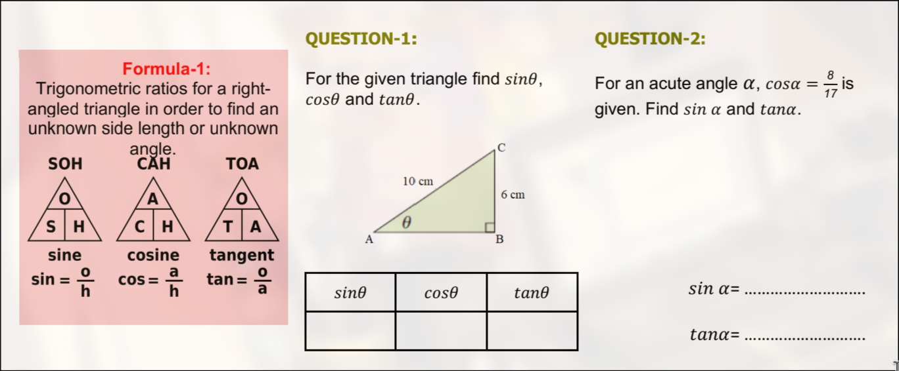

1. $AB = \sqrt{10^2 - 6^2} = 8$ 
   $\theta = sin^{-1} (\frac{6\~cm}{10\~cm}) = 36.87$ 
   $sin \theta = 3/5$ 
   $cos \theta = 4/5$ 
   $tan \theta = 5/4$  

2. $sin a = sin (cos^{-1} \frac{8}{17}) = 0.88$ 
   $tan a = tan (cos^{-1} \frac{8}{17}) = 1.875$  

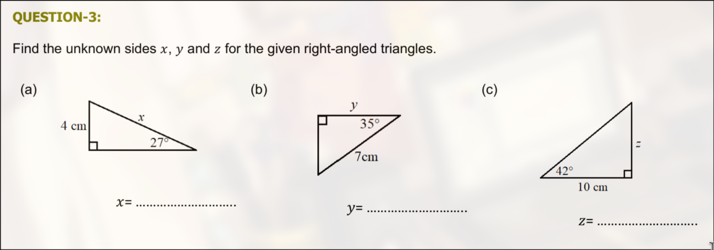

3. (a) $x = \frac{4\~cm \cdot sin 90 \degree}{sin 27 \degree} = 8.81\~cm$  
   (b) $y = \frac{7\~cm \cdot sin 55 \degree}{sin 90 \degree} = 5.73\~cm$  
   (c) $z = \frac{10\~cm \cdot sin 42 \degree}{sin 48 \degree} = 9.00\~cm$  

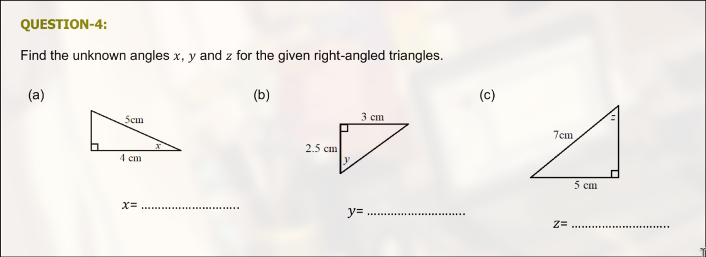

4. (a) $x = sin^{-1} (\frac{3\~cm \cdot sin 90 \degree}{5\~cm}) = 36.87 \degree$  
   (b) $h = \sqrt{2.5^2\~cm + 3^2\~cm} = 3.91\~cm$  
       $y = sin^{-1} (\frac{3\~cm \cdot sin 90 \degree}{3.91\~cm}) = 50.11 \degree$ 
   (c) $z = sin^{-1} (\frac{5\~cm \cdot sin 90 \degree}{7\~cm}) = 45.58 \degree$  

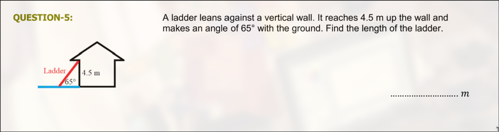

5. $h = \frac{sin 90 \degree \cdot 4.5\~m}{sin 65 \degree} = 4.97\~m$  

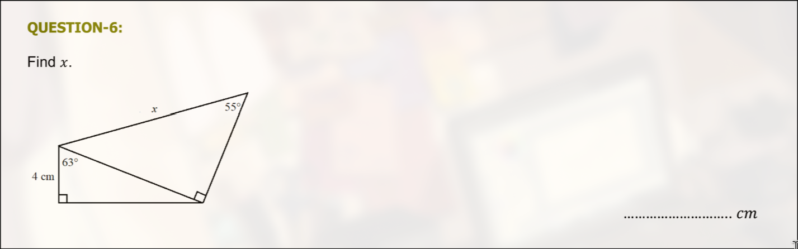

6. $o_s = \frac{sin 63 \degree \cdot 4\~cm}{sin 27 \degree} = 8.76\~cm$ 
   $h_s = (4^2 + 8.76^2)^{1/2} = 9.64\~cm$ 
   $x = \frac{sin 90 \degree \cdot 10.15\~cm}{sin 55 \degree} = 12.39\~cm$  

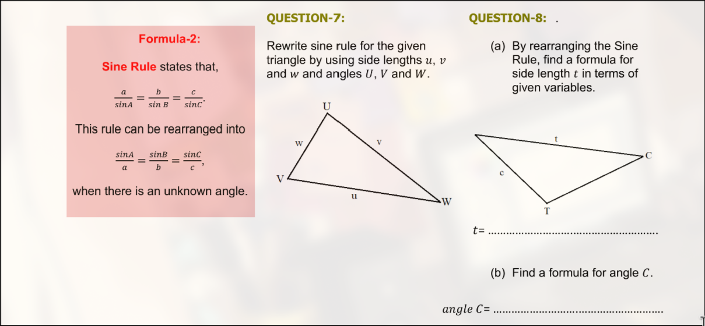

7. $\frac{u}{sin U} = \frac{v}{sin V} = \frac{w}{sin W}$ 
   $\frac{sin U}{u} = \frac{sin V}{v} = \frac{sin W}{w}$  

8. (a) $t = \frac{sin T \cdot c}{sin C}$  
   (b) $C = sin^{-1} (\frac{c \cdot sin T}{t})$  

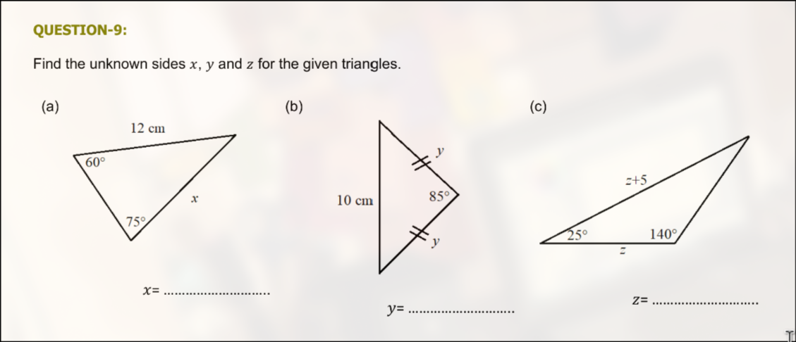

9. (a) $x = \frac{sin 60 \degree \cdot 12\~cm}{sin 75 \degree} = 9.6\~cm$  
   (b) $Y = \frac{180 \degree - 85 \degree}{2} = 47.5 \degree$ 
       $y = \frac{sin 47.5 \degree \cdot 10\~cm}{sin 85 \degree} = 7.40\~cm$  
   (c) $Z = 15 \degree$ 
       $\frac{z}{sin 15 \degree} = \frac{z + 5}{sin 140 \degree}$ 
       $z = \frac{(z + 5) \cdot sin 15 \degree}{sin 140 \degree}$ 
       $z => 3.37$  

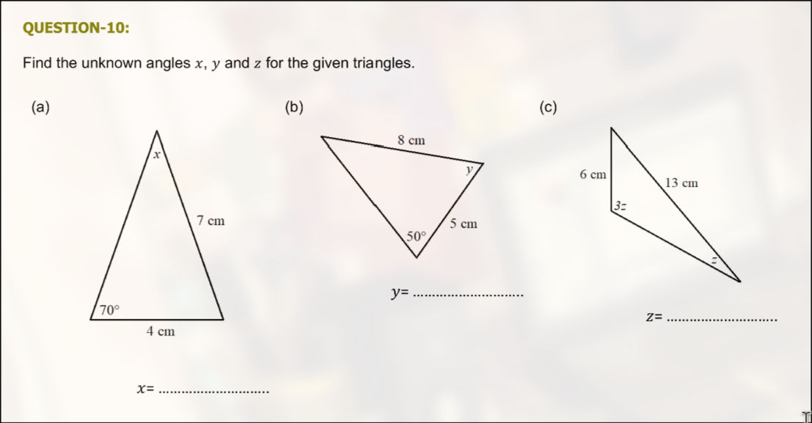

10. (a) $x = sin^{-1} (\frac{4\~cm \cdot sin 70 \degree}{7\~cm}) = 32.48 \degree$  
    (b) $\angle \~cm = sin^{-1} (\frac{5\~cm \cdot sin 50 \degree}{8\~cm}) = 28.61 \degree$ 
        $y = 180 \degree - 28.61 \degree - 50 \degree = 101.39 \degree$  
    (c) $z = sin^{-1} (\frac{6\~cm \cdot sin 3z}{13\~cm})$ 
        $z = 27.16 \degree$  

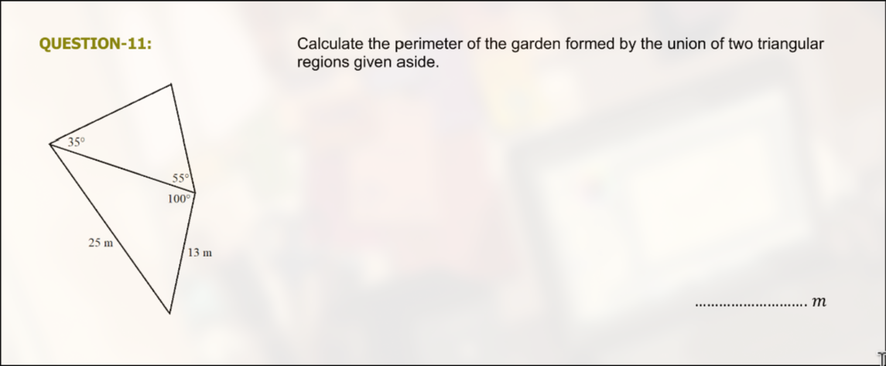

11. $l = 25\~cm + 13\~cm + o_{35 \degree} + o_{55 \degree}$ 
    $\angle 13 m = sin^{-1} (\frac{13\~cm \cdot sin 100 \degree}{25\~cm}) = 30.80 \degree$ 
    $180 \degree - 100 \degree - 30.80 \degree = 49.2 \degree$ 
    $o_{90 \degree} = o_{49.2 \degree} = \frac{sin 49.2 \degree \cdot 25\~cm}{sin 100 \degree} = 19.22\~cm$ 
    $o_{35 \degree} = \frac{sin 35 \degree \cdot 19.22\~cm}{sin 90 \degree} = 11.02\~cm$ 
    $o_{55 \degree} = \frac{sin 55 \degree \cdot 19.22\~cm}{sin 90 \degree} = 15.74\~cm$ 
    $l = 25\~cm + 13\~cm + 11. + o_{55 \degree} = 62.40\~cm$  

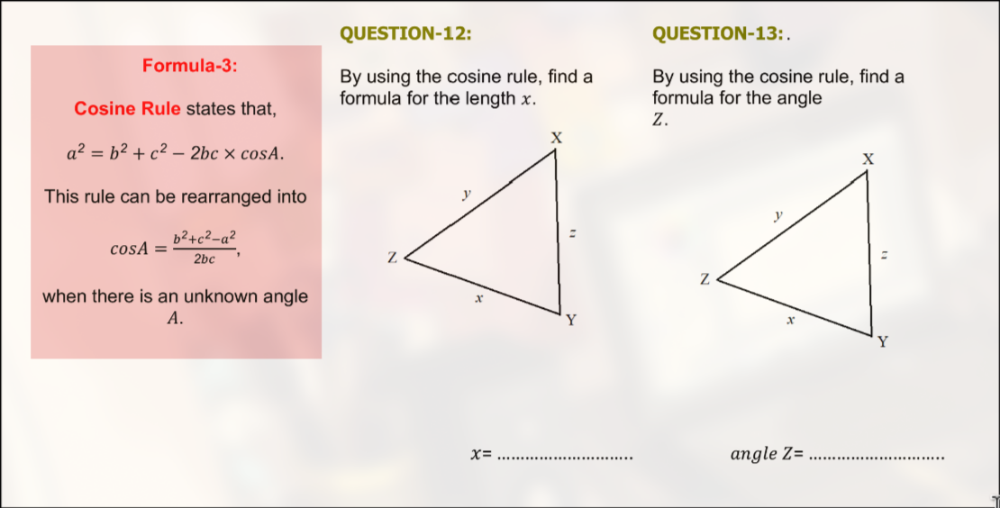

12. $x = \sqrt{y^2 + z^2 - 2yz \cdot cos X}$  

13. $Z = cos^{-1} (\frac{x^2 + y^2 - z^2}{2xy})$  

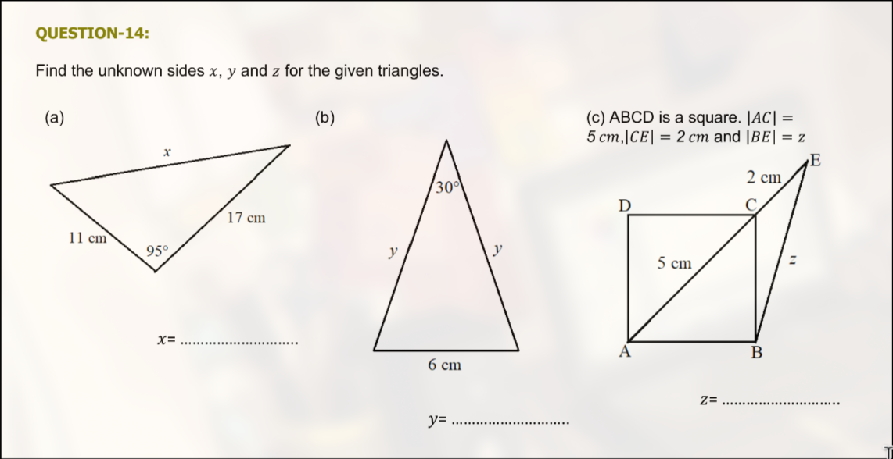

14. (a) $x = \sqrt{11^2\~cm + 17^2\~cm - 2 \cdot 11 \cdot 17 \cdot cos 95 \degree} = 21.04\~cm$  
    (b) $6\~cm = \sqrt{y^2 + y^2 - 2y^2 \cdot cos 30 \degree}$ 
        $6\~cm = \sqrt{2y^2 - \sqrt{3}y^2}$ 
	$y = 11.59\~cm$  
    (c) $AB = \frac{5}{\sqrt{2}}$ 
        $z = \sqrt{\frac{5}{\sqrt{2}}^2\~cm+ 7^2\~cm - 2 \cdot \frac{5}{\sqrt{2}}\~cm \cdot 7\~cm \cdot cos 45 \degree}$ 
	$z = 5.15\~cm$  

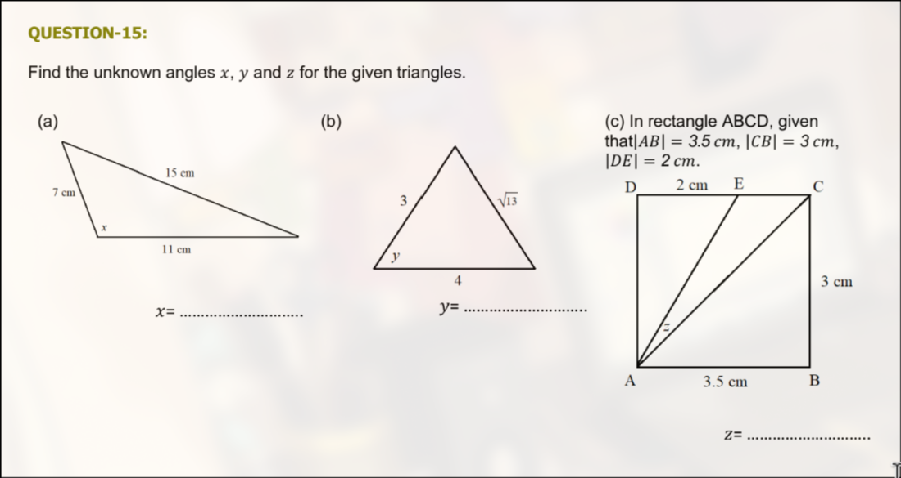

15. (a) $x = cos^{-1} (\frac{11^2\~cm + 7^2\~cm - 15^2\~cm}{2 \cdot 11\~cm \cdot 7\~cm})$ 
        $x = 110.92 \degree$  
    (b) $y = cos^{-1} (\frac{3^2 + 4^2 - \sqrt{13}^2}{2 \cdot 3 \cdot 4})$ 
        $y = 60 \degree$  
    (c) $AE = \sqrt{2^2\~cm + 3^2\~cm} = \sqrt{13}$ 
        $AC = \sqrt{3^2\~cm + 3.5^2\~cm} = \sqrt{21.25}$ 
	    $EC = 3.5\~cm - 2\~cm = 1.5\~cm$ 
	    $z = cos^{-1} (\frac{13\~cm^2 + 21.25\~cm^2 - 1.5^2\~cm}{2 \cdot \sqrt{13} \cdot \sqrt{21.25}})$ 
	    $z = 15.71 \degree$  

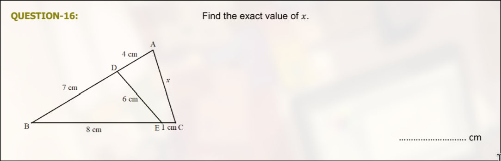

16. $B = cos^{-1} (\frac{7^2\~cm + 8^2\~cm - 6^2\~cm}{2 \cdot 7\~cm \cdot 8\~cm})$ 
    $B = 46.57 \degree$ 
    $x = \sqrt{11^2\~cm + 9\~^2\~cm - 2 \cdot 11\~cm \cdot 9\~cm \cdot cos 46.57 \degree}$ 
    $x = 8.12\~cm$  

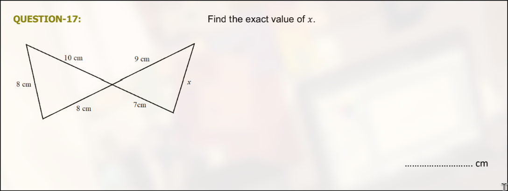

17. $\angle_{8\~cm} = cos^{-1} (\frac{10^2\~cm + 8^2\~cm - 8^2\~cm}{2 \cdot 10\~cm \cdot 8\~cm})$ 
    $\angle_{8\~cm} = 51.32 \degree = \angle x$ 
    $x = \sqrt{9^2\~cm + 7^2\~cm - 2 \cdot 9\~cm \cdot 7\~cm \cdot cos 51.32 \degree}$ 
    $x = 7.16\~cm$  

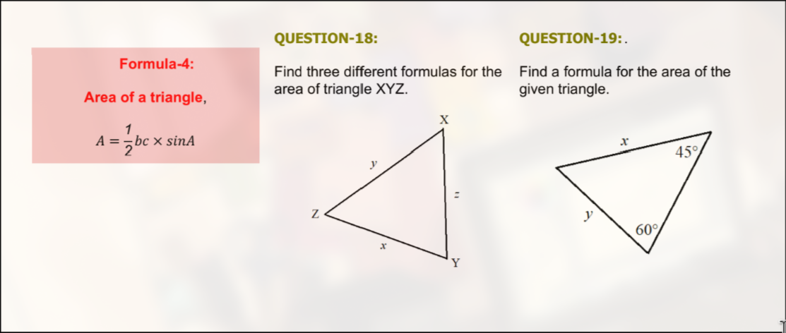

18. $A = \frac{y \cdot z \cdot sin X}{2}$ 
    $A = \sqrt{s \cdot (s - x) \cdot (s - y) \cdot (s - z)}$, where $s = \frac{x + y + z}{2}$ 
    $$  

19. $A = \frac{sin (180 \degree - 60 \degree - 45 \degree) \cdot x \cdot y}{2}$  

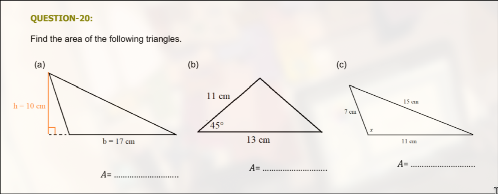

20. (a) $A = \frac{17\~cm \cdot 10\~cm}{2}$ 
        $A = 85\~cm^2$  
    (b) $o_{45 \degree} = \sqrt{11^2\~cm + 13^2\~cm - 2 \cdot 11 \cdot 13 \cdot cos 45 \degree}$ 
        $o_{45 \degree} = 9.37\~cm$  
	    $s = \frac{11\~cm + 13\~cm + 9.37\~cm}{2}$ 
	    $s = 16.68\~cm$ 
        $A = \sqrt{s \cdot (s - 11) \cdot (s - 13) \cdot (s - 9.37)}$ 
	    $A = \frac{11\~cm \cdot 13\~cm \cdot sin 45 \degree}{2}$ 
	    $A = 50.56\~cm^2$  
    (c) $x = cos^{-1} (\frac{7^2\~cm + 11^2\~cm - 15^2\~cm}{2 \cdot 7\~cm \cdot 11\~cm})$ 
        $x = 110.92 \degree$ 
    	$A = \frac{7\~cm \cdot 11\~cm \cdot sin 110.92 \degree}{2}$ 
    	$A = 33.96\~cm^2$  

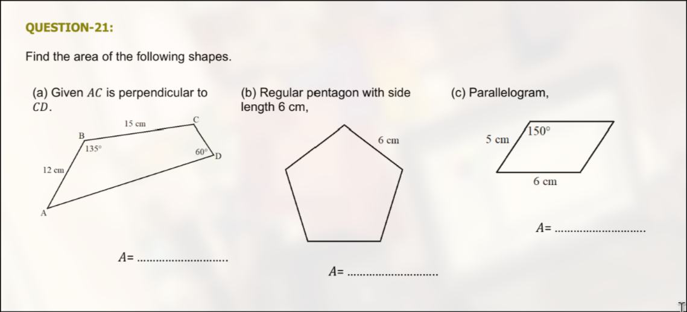

21. (a) $A_{ABC} = \frac{12\~cm \cdot 15\~cm \cdot sin 135 \degree}{2}$ 
        $A_{ABC} = 45 \sqrt{2} = 63.64\~cm^2$ 
    	$AC = \sqrt{12^2\~cm + 15^2\~cm - 2 \cdot 12\~cm \cdot 15\~cm \cdot cos 135 \degree}$ 
    	$AC = 24.97\~cm$ 
    	$CD = \frac{sin 30 \degree \cdot 24.97\~cm}{sin 60 \degree}$ 
    	$CD = 14.42\~cm$ 
    	$A_{ACD} = \frac{24.97\~cm \cdot 14.42\~cm}{2}$ 
    	$A_{ACD} = 180.01\~cm^2$  
    (b) $\theta = \frac{360 \degree}{5} = 72 \degree$ 
        $54 \degree = \frac{180 \degree - 72 \degree}{2}$ 
        $r = \frac{sin 54 \degree \cdot 6\~cm}{sin 72 \degree}$ 
    	$r = 5.10\~cm$ 
    	$A = 5 \cdot \frac{5.10^2\~cm \cdot sin 72 \degree}{2}$ 
    	$A = 61.94\~cm^2$  
    (c) $height = \frac{sin 30 \degree \cdot 5\~cm}{sin 90 \degree}$ 
        $height = 2.5\~cm$ 
    	$A = 2.5\~cm \cdot 6\~cm$ 
    	$A = 15\~cm^2$  

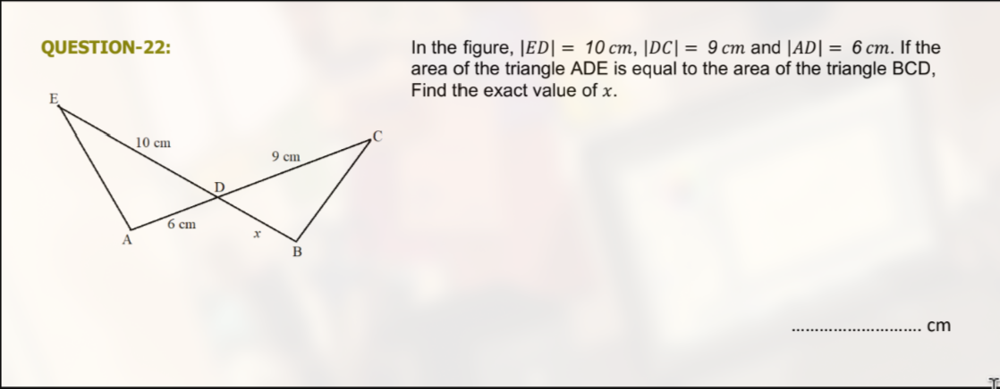

22. $\frac{10\~cm \cdot 6\~cm \cdot sin \theta}{2} = \frac{9\~cm \cdot x \cdot sin \theta}{2}$ 
    $10\~cm \cdot 6\~cm = 9\~cm \cdot x$ 
    $x = \frac{60\~cm^2}{9\~cm}$ 
    $x = 6 \frac{2}{3} = 6.67\~cm$  

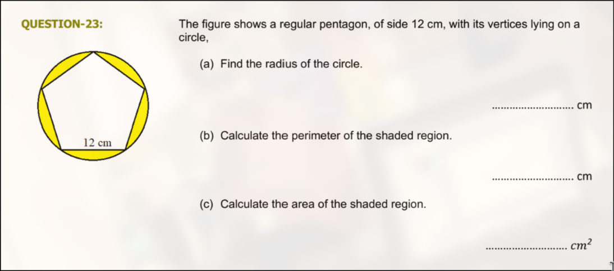

23. (a) $54 \degree = \frac{180 \degree - 72 \degree}{2}$ 
        $r = \frac{sin 54 \degree \cdot 12\~cm}{sin 72 \degree}$  
    	$r = 10.21\~cm$  
    (b) $l_{shaded} = (2 \pi \cdot 10.21\~cm) + 5 \cdot 12\~cm$ 
        $l_{shaded} = 124.14\~cm$  
    (c) $A_{pentagon} = 5 \cdot \frac{10.21^2\~cm \cdot sin 72 \degree}{2}$ 
        $A_{pentagon} = 247.75\~cm^2$ 
    	$A_{circle} = \pi \cdot 10.21^2\~cm$ 
    	$A_{circle} = 327.35\~cm^2$ 
    	$A_{shaded} = 327.35\~cm^2 - 247.75\~cm^2$ 
    	$A_{shaded} = 79.60\~cm^2$  

8. $A = \pi \cdot 400^2\~m$ 
   $A = 502654.82\~cm^2$ 
   $A h^{-1} = \frac{A}{24 h}$ 
   $A h^{-1} = 20943.95\~cm^2 h^{-1}$  

6. $l = \frac{\theta}{2} \cdot r^2$ 
   $\frac{2 l}{\theta} = r^2$ 
   $r = \sqrt{\frac{2 l}{\theta}}$  

7. $Maria = \frac{112 \degree \cdot 2 \pi \cdot 230 m}{360 \degree}$ 
   $Maria = 449.60\~m$ 
   $Norbert = \frac{66 \degree \cdot 2 \pi \cdot 500 m}{360 \degree}$ 
   $Norbert = 575.96\~m$ 
   $Norbert - Maria = 126.36\~m$ 
   Norbert walks further than Maria by $126.36\~m$.  

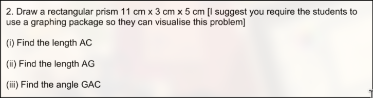

2. (i)    $AC = \sqrt{11^2\~cm + 5^2\~cm}$ 
          $AC = \sqrt{146}\~cm = 12.1\~cm$  
   (ii)   $AG = \sqrt{146\~cm + 3^2\~cm}$ 
          $AG = \sqrt{155}\~cm = 12.4\~cm$  
   (iii)  $\angle GAC = cos^{-1} (\frac{12.1^2\~cm + 12.4^2\~cm - 3^2\~cm}{2 \cdot 12.1\~cm \cdot 12.4\~cm})$ 
          $\angle GAC = 14.0 \degree$  

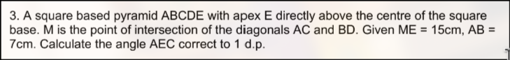

3. $l = \sqrt{15^2\~m + 3.5^2\~m} = 18.37\~m$ 
   $\angle AEB = cos^{-1} (\frac{18.37^2\~m + 18.37^2\~m - 7^2\~m}{2 \cdot 18.37^2\~m})$ 
   $\angle AEB = 26.27 \degree$  

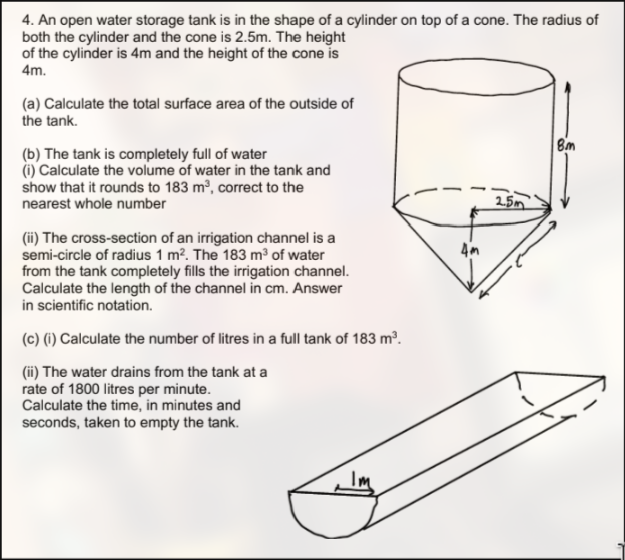

4. (a) $A_{total}$ = Tube Blanket Area + Cylinder Top + Cone Area 
       $A_{total} = (2 \pi \cdot 2.5\~m \cdot 8\~m) + (\pi 2.5^2\~m) + (2.5\~m \pi \cdot \sqrt{4^2\~m + 2.5^2\~m})$ 
       $A_{total} = 125.66\~m^2 + 19.63\~m^2 + 37.05\~m^2$ 
       $A_{total} = 182.35\~m^2$  
   (b) (i)  $V_{total} = Cylinder\~Volume + Cone\~Volume$ 
            $V_{total} = 2.5^2\~m \pi \cdot 8\~m + \frac{2.5^2\~m \pi \cdot 4\~m}{3}$ 
            $V_{total} = 157.08\~m^3 + 26.18\~m^3$ 
            $V_{total} = 183.26\~m^3$  
       (ii) $l = \frac{2 \cdot V_{total}}{r \pi}$ 
            $l = \frac{2 \cdot 183.26\~m^3}{1^2\~m \pi}$ 
            $l = 116.67\~m$  
   (c) (i)  $m^3 = 1000\~L$ 
            $V_{litres} = (1000 \cdot 183.26)\~L$ 
            $V_{litres} = 183259.57\~L$  
       (ii) $t_{to\~empty} = \frac{183259.57\~L \cdot 60\~s}{1800\~L}$ 
            $t_{to\~empty} = 6108.65 s$ 
            $t_{to\~empty} = 101$ minutes, $48.65$ seconds.  

10. (a) $\frac{2 \pi \cdot 6370\~km}{360 \degree \cdot 60}$ 
        $1.85\~km$  
    (b) $2 \pi \cdot 6370\~km \cdot \frac{1}{4}$ 
        $10005.97\~km$  

11. $(\frac{3}{4} \cdot \pi 10^2\~m) + (\frac{\pi 5^2\~cm}{4}) + (\frac{\pi 2^2\~cm}{4})$ 
    $235.62\~cm^2 + 19.63\~cm^2 + 3.14\~cm^2$ 
    $791.37\~cm^2$  
