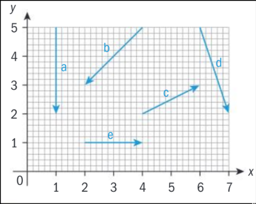
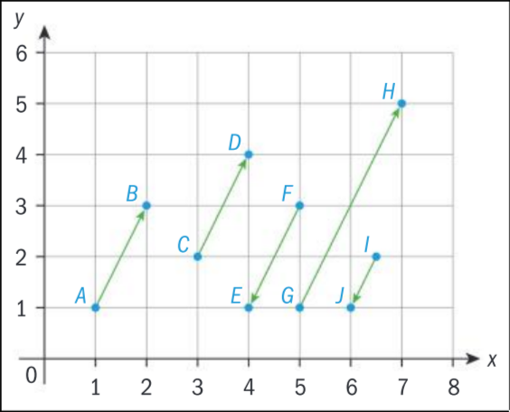
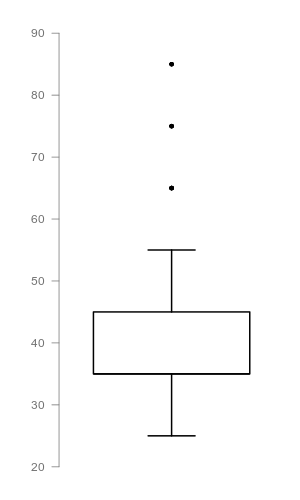
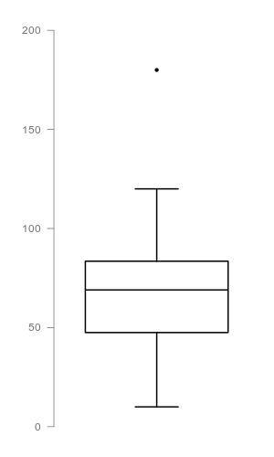
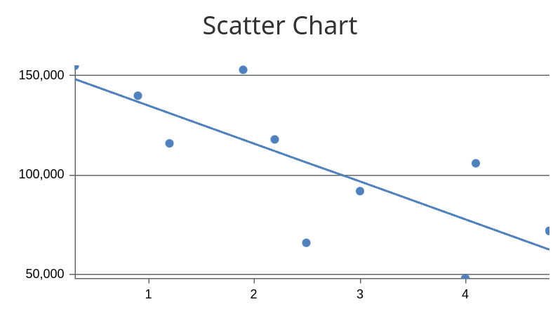
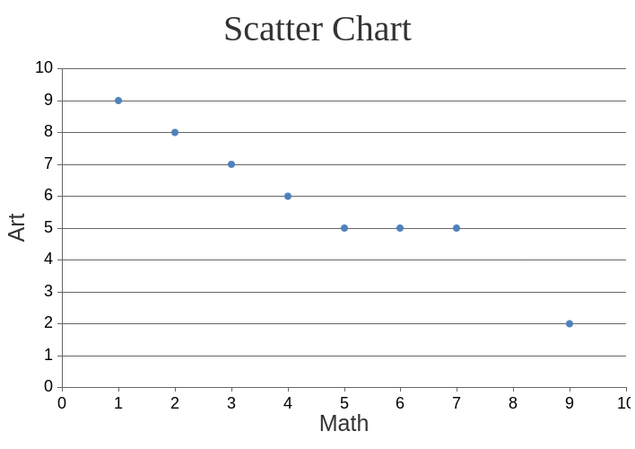
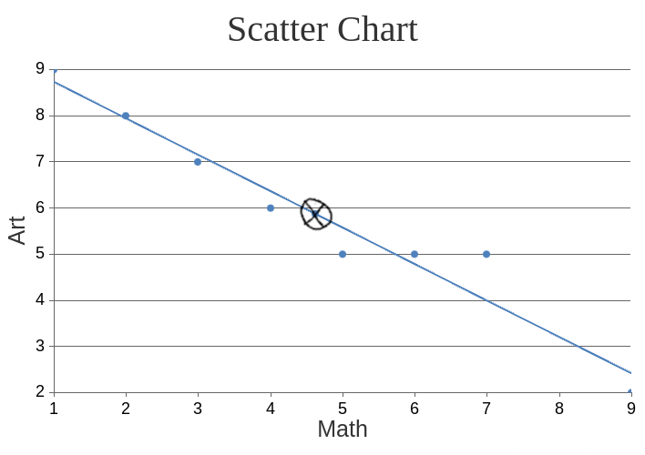

# Term 4

## Vectors

It's like a segment, a line with ending on two point, except it has a direction.
The common symbols for a vector are lowercase: u, v, and w.

We write it with matrix, for example,
A vector from point A (1, 1) to point B (4,6) will be wrote down as [3 5], with the values representing the differences.
It can also be written as $3i + 5j$, with i as X, and j as Y.

Note that direction matters; if it's point B to point A, it'll be [-3 -5].
As you might notice, This means that $AB == -BA$.

- $u + v$
- $[3 5] + [-3 -5]$ <!-- TODO: make the proof -->
- $[(3 - 3) (5 - 5)]$
- $[0 0]$
- $0$

### Exercise 3H

1.  
   a = [0 -3]  -> $-3j$ 
   b = [-2 -2] -> $-2i - 2j$ 
   c = [2 1]   -> $2i + j$ 
   d = [1 -3]  -> $i - 3j$ 
   e = [2 0]   -> $2i$ 

2. Find:
   1. [2 1] + [-5 3] 
      [(2 - 5) (1 + 3)] 
      [-3 4]
   2. $(3i - j) + (4i + 5j)$ 
      $7i + 4j$
   3. [-2 5] + [-4 -3] 
      [-6 2]
   4. $(i - 2j) + 4i$ 
      $5i - 2j$ 

3. Find
   1. [2 3] + [2 3] 
      [4 + 6]
   2. [2 3] + [2 3] + [2 3] 
      [6 9]
   3. Explain how you multiply a vector by a scalar. 
      Just multiply each all elements in a vector by the scalar.
   4. $i$ and $j$ can also be written as [1 0] and [0 1], hence verify $3i + 4j =$ [3 4] 
      [3 0] + [0 4] 
      [3 4] 

4. Let AB = [1 2] as shown. 
    
   1. Write the following vectors in component form and in terms of the vector AB:
      1. CD 
         $i + 2j$ 
         CD $= AB$
      2. FE 
         $-i - 2j$ 
         FE $= -AB$
      3. GH 
         $2i + 4j$ 
         GH $= 2 \cdot AB$
      4. IJ 
         $\frac{i}{2} - j$ 
         IJ $= \frac{AB}{-2}$ 

5. State which of the following vectors are parallel to $5i + 2j$.
   1. $-5 - 2j$ 
      Parallel
   2. $25i - 10j$ 
      Not parallel
   3. $-i - 0.4j$ 
      Parallel
   4. $[20 50]$ 
      Not parallel
   5. $[4 6] + [6 -2]$ 
      Parallel
   6. $2 \cdot$ [-10 4] 
      Not parallel
   7. $2 \cdot$ [3 3] $- 3 \cdot$ [-3 0] 
      Parallel 

 6. Solve:
    1. Find $p$ and $q$ if
       1. [4p 6] + [6 - 2q] = [-2p 2] 
          $4p + 6 = -2p$ 
          $6p = -6$ 
          $p = -1$ 
          $-2q + 6 = 2$ 
          $-2q = -4$ 
          $q = 2$
       2. [-3p -2q] + [2q p] = [7 1] 
          $-3p + 2q = 7$ 
          $p + -2q = 1$ 
          $-2p = 8$ 
          $p = -4$ 
          $12 + 2q = 7$ 
          $q = -2.5$
    2. 1. Find $p$ if [(p + 1) (2p)] is parallel to [4 1] 
          [(p + 1) 2p] $= k \cdot$ [4k k] 
          $p + 1 = 4k$ 
          $2p = k$ 
          $-7p + 1 = 0$ 
          $p = \frac{1}{7}$
       2. Find $q$ if [(2q - 3) (q + 6)] is parallel to [-3 1] 
          $2q - 3 = -3k$ 
          $q + 6 = k$ 
          $5q + 15 = 0$ 
          $q = -3$ 

## Exercise 3I

1. The points A, B and C have coordinates (1, 4), (2, 5) and (−1, 6) respectively.
   1. Find the vectors
      1. OA 
         [1 4]
      2. AB 
         AB = AO + OB 
         AB = [-1 -4] + [2 5] 
         AB = [1 1]
      3. AC 
         AC = AO + OC 
         AB = [-1 -4] + [-1 6] 
         AB = [-2 2]
      4. CA 
         CA = CO + OA 
         CA = [1 -6] + [1 4] 
         CA = [2 -2]
   2. The point D is such that CD is equal to [4 1]
      1. Write down an equation that gives BD in terms of BA, AC and CD 
         BD = BA + (AC + CD)
      2. Hence write down an equation that gives BD in terms of AB , AC and CD 
         BD = -AB + (AC + CD)
      3. Hence find BD 
         BD = -AB + (AC + CD) 
         BD = [-1 -1] + ([-2 2] + [4 1]) 
         BD = [1 2]
      4. Find the coordinates of D 
         OD = OB + BD 
         OD = [2 5] + [1 2] 
         OD = [3 7]
         D = (3, 7)
2. Answer!
   1. AB = [1 4] and BC = [-1 2], find:
      1. AC; and 
         AC = AB + BC 
         AC = [1 4] + [-1 2] 
         AC = [0 6]
      2. CA 
         CA = -AC 
         CA = [0 -6]
   2. AB = [2 4] and BC = [1 3], and AD = [2 3] find DC 
      DC = -AD + (AB + BC) 
      DC = [-2 -3] + ([2 4] + [1 3]) 
      DC = [1 4]
3. 3 The points A, B, C and D have coordinates (1,0), (2,3), (7,5) and (6,2) respectively.
   1. Find the vectors AB and DC 
      AB = B - A 
      AB = (2, 3) - (1, 0) 
      AB = [1 3] 
      DC = C - D 
      DC = (7, 5) - (6, 2) 
      DC = [1 3]
   2. State which type of quadrilateral is formed by ABCD. Justify your answer.
      
   3. State two other vectors which must be equal.
4. An aircraft flies from an airport at A to one at B and then on to C. The routes taken can be given by the vectors AB = [75 90] and BC = [-35 -100] km.
   1. Find the vector AC 
      AC = AB + BC 
      AC = [75 90] + [-35 -100] 
      AC = [40 -10]
   2. The aircraft then flies directly back to A. Write down the vector that describes this flight. 
      CA
   3. Calculate the direct distance from C to A. 
      CA = -AC 
      CA = [-40 10]
      $\sqrt{-40^2 + 10^2}$
      $41.2 km$
5. A surveyor is putting flags out in a large field. His movements between the flags can be described by the vectors (5i + j), (−2i + 4j), (4i + 2j), (6i + 4j).
   1. Find his displacement from his starting position when he puts out the last flag. 
      $(5i + j) + (−2i + 4j) + (4i + 2j) + (6i + 4j)$ 
      $13i + 11j$
   2. Write down the displacement vector that will take him back to his starting position 
      $-13i - 11j$

## Investigation 8

1. A boy walks 5km on a bearing of 045˚ and then 8km on a bearing of 120˚
   1. ******
   2. Use the cosine and sine rules to find his distance and bearing from his starting point at the end of the walk. 
      $u = \sqrt{5^2 + 8^2 - 2 \cdot 5 \cdot 8 cos 105 \degree}$ 
      $u = 10.5 km$ 
      $\frac{sin \theta}{8} = \frac{sin 105 \degree}{10.5 km}$ 
      $\theta = 47.4 \degree$
   3. Answer!
      1. Write the displacements 5km on a bearing of 045˚ and 8km on a bearing of 120˚ as column vectors where the first component indicates displacement east and the second displacement north. 
         5 km -> [3.536 -3.536] 
         8 km -> [4.330 -2.5]
      2. Use your answer to part c i to find how far east and how far north from his starting point the boy is at the end of his walk. 
         east $= 3.536 + 4.330 = 7.866$ 
         north $= -3.536 - 2.5 = -6.036$
      3. Hence give his resultant (final) displacement as a column vector. 
         [7.866 -6.036]
      4. Use your answer to part c iii to find his distance and bearing from his starting point at the end of the walk. 
         distance $= \sqrt{7.866^2 + (-6.036)^2} = 9.92$ 
         bearing $= $ <!-- TODO: Finish this -->

## Exercise 3J

1. For the resultant of each of the vector sums: [1 3] + [-1 2] + [4 -1], $(5i + 2j) + (-6i - 4j)$, 2 [3 2] - 3 [-4 -1], $5 (i + 2j) + 3 (i - 3j)$; find the
   1. magnitude
      1. [4 4] 
         $\sqrt{4^2 + 4^2}$ 
         $5.66$
      2. $-i - 2j$ 
         $\sqrt{(-1)^2 + (-2)^2}$ 
         $2.24$
      3. [18 7] 
         $\sqrt{18^2 + 7^2}$ 
         $19.3$
      4. $8i + j$ 
         $\sqrt{8^2 + 1^2}$ 
         $8.06$
   2. direction (as an angle anti-clockwise from the direction of i)
      1. $315 \degree$
      2. $270 - sin^{-1} (\frac{sin 90 \degree \cdot 1}{\sqrt{2^2 + 1^1}})$ 
         $270 - 26.6 \degree$ 
         $243.4 \degree$
      3. $sin^{-1} (\frac{sin 90 \degree \cdot 7}{\sqrt{18^2 + 7^2}})$ 
         $tan^{-1} (\frac{7}{18})$ 
         $21.3 \degree$
      4. $sin^{-1} (\frac{sin 90 \degree}{\sqrt{8^2 + 1^2}})$ 
         $7.1 \degree$
2. The magnitude of a vector [a b] can be written as |a b|.
   1. Verify that |48 20| is equal to 4 |12 5|. 
      $|48 20| = |(4 \cdot 12) (5 \cdot 4)|$ 
      $|48 20| = |48 20|$
   2. By first taking out a factor and without using a GDC, find the magnitude of
      1. [18 24] 
         $\sqrt{18^2 + 24^2}$ 
         $30$
      2. [-30 40] 
         $\sqrt{(-30)^2 + 40^2}$ 
         $50$
      3. [28 -21] 
         $\sqrt{28^2 + (-21)^2}$ 
         $35$
4. A man walking in a large field walks 200m north-east and 175m west.
   1. Write each of the displacements as a column vector. 
      [200cos45 200sin45] & [-175 0]
   2. Hence find his final distance from his starting point. 
      [(200cos45 - 175) 200sin45] 
      [-33.6 141] 
      $145$
5. A boat sails 4km on a bearing of 030°, followed 3km south-east, then 4km due east and 2km on a bearing of 080° as shown on the right. Determine its final distance from the starting point. Find also the bearing it would have to travel on to return directly to the starting point. 
   $x = 4 sin 30 + 3 cos 45 + 4 + 2 cos 10$ 
   $x = 10.91936297$ 
   $y = 4 cos 30 - 3 sin 45 + 0 + 2 sin 80$ 
   $y = 3.312396778$ 
   $d = \sqrt{x^2 + y^2}$ 
   $d = 11.4 km$ 
   $\theta = 270 - tan^{-1} (\frac{y}{x})$ 
   $\theta = 253 \degree$

## Exercise 3K

1. Find the magnitude of each of the following vectors without using a calculator.
   1. $8i − 4j + k$ 
      $\sqrt{8^2 + 4^2 + 1^2}$ 
      $\sqrt{64 + 16 + 1}$ 
      $\sqrt{81}$ 
      $9$
   2. [2 1 2] 
      $\sqrt{2^2 + 1^2 + 2^2}$ 
      $\sqrt{4 + 1 + 4}$ 
      $\sqrt{9}$ 
      $3$
   3. 3 [4 -3 0] 
      $\sqrt{12^2 + (-9)^2}$ 
      $\sqrt{144 + 81}$ 
      $\sqrt{225}$ 
      $15$
   4. $5 (2i − 3j + 6k)$ 
      $\sqrt{10^2 + (−15)^2 + 18^2}$ 
      $\sqrt{100 + 225 + 324}$ 
      $\sqrt{649}$ 
      $\sqrt{649}$
2. A small plane travels along the three vectors [3 1 2], [2 4 1] and [7 4 3] in succession. State the vector it will have to travel along to return to its starting point. 
   -1 ([3 1 2] + [2 4 1] + [7 4 3]) 
   -1 [12 9 6] 
   [-12 -9 -6]
3. Answer!
   1. If A and B have position vectors a and b and if M is the midpoint of [AB] show that OM $= \frac{1}{2} (a + b)$.
   2. Three points P, Q and R have coordinates (1, 3, 6), (−1, 0 5) and (2, 4, −1). Find the vectors PQ and QR. 
      PQ = OQ - OP 
      PQ = [-1 0 5] + [-1 -3 -6] 
      PQ = [-2 -3 -1] 
      QR = OR - OQ 
      QR = [2 4 -1] - [-1 0 5] 
      QR = [3 4 -6]
   3. Hence or otherwise find the vector PR 
      PR = PQ + QR 
      PR = [-2 -3 -1] + [3 4 -6] 
      PR = [1 1 -7]
   4. The quadrilateral PQRS is a parallelogram. Find the coordinate of S. 
      QR = PS 
      [3 4 -6] = OS - OP 
      OS = [4 7 0] 
      PQ = SR 
      [-2 -3 -1] = OR - OS 
      OS = [4 7 0]
   5. Find the midpoint of the vector PR 
      $\frac{1}{2}$ PR $= \frac{1}{2}$ (p + r) 
      $= \frac{1}{2}$ ([1 3 6] + [2 4 -1]) 
      $= \frac{1}{2}$ [3 7 5] 
      $=$ [1.5 3.5 2.5]
   6. Find the midpoint of the vector QS 
      QS = OS - OQ 
      QS = [4 7 0] - [-1 0 5] 
      QS = [5 0 5] 
      $\frac{1}{2}$ QS $= \frac{1}{2}$ (q + s) 
      $= \frac{1}{2}$ ([-1 0 5] + [4 7 0]) 
      $= \frac{1}{2}$ [3 7 5] 
      $=$ [1.5 3.5 2.5]
   7. What do the answers for parts e and f tell you about the diagonals of a parallelogram? 
      They intersect each other at their midpoint

## Scalar and Vector Product

$a \cdot b = a_1 b_1 + a_2 b_2$ 
$a \cdot b = |a| |b| cos \theta$ 
$cos \theta = \frac{a \cdot b}{|a| |b|}$

### Practice

Find the angles between vector:

1. (2i + j - 3k) and (-2i + 10j + 2k) 
   $cos^{-1} (\frac{-4i + 10j - 6k}{4i + 10j + 6k})$ 
   $cos^{-1} (\frac{-4i + 10j - 6k}{4i + 10j + 6k})$
   $cos^{-1} (-i + j - k)$

### Exercise 3L

1. Calculate the angle between the following pairs of vectors
   1. [2 -1 4] and [3 1 2] 
      $40.7 \degree$
   2. [2 0 1] and [-2 1 -1] 
      $156 \degree$
   3. [2 1 -1] and [3 2 0] 
      $25.1 \degree$
   4. [2 -1 -2] and [3 2 -5] 
      $40.8 \degree$
   5. [2 3] and [4 6] 
      $0$
   6. [2 0 1] and [-4 0 -2] 
      $180 \degree$
2. A triangle has vertices at the points A(1,2, 3), B(0,2,5) and C(1,3,−2)
   1. State which two vectors you could use to find the angle at 
      1. A 
         AB and AC
      2. B 
         BA and BC
   2. Find all the angles of the triangle 
      $\angle BAC =$
      $cos^{-1} (\frac{AB AC}{|AB| |AC|}) =$
      $cos^{-1} (\frac{[-1\~0\~2] \cdot [0\~1\~-5]}{\sqrt{(-1)^2 + 2^2} \cdot \sqrt{1^2 + (-5)^2}}) =$
      $cos^{-1} (\frac{-10}{11.40175425}) =$
      $151 \degree$  
      $\angle ABC =$
      $cos^{-1} (\frac{BA BC}{|BA| |BC|}) =$
      $cos^{-1} (\frac{[-1\~0\~-2] \cdot [1\~1\~-7]}{\sqrt{(-1)^2 + (-2)^2} \cdot \sqrt{1^2 + 1^2 + (-7)^2}}) =$
      $cos^{-1} (\frac{-1 + 14}{15.96871942}) =$
      $35.5 \degree$  
      $\angle ACB =$
      $cos^{-1} (\frac{AC CB}{|AC| |CB|}) =$
      $cos^{-1} (\frac{[0\~1\~-5] \cdot [-1\~-1\~7]}{\sqrt{1^2 + (-5)^2} \cdot \sqrt{(-1)^2 + (-1)^2 + 7^2}}) =$
      $cos^{-1} (\frac{-1 + -35}{36.41428291}) =$
      $171 \degree$
   3. Find the length of the longest side
      $|BC| =$
      $\sqrt{1^2 + 1^2 + (-7)^2} =$
      $7.14$
3. Find p if the two vectors given are perpendicular.
   1. $[2\~1\~p] and []-3p\~2\~-2]$ 
      $[2\~1\~p] \cdot [-3p\~2\~-2] = 0$ 
      $-6p + 2 - 2p = 0$ 
      $-8p = -2$ 
      $p = 0.25$
   2. $[p\~-2\~4] and [p-1\~p\~-1]$ 
      $[p\~-2\~4] \cdot [p-1\~p\~-1]$ 
      $p^2-p -2p -4 = 0$ 
      $p^2-3p = 4$ 
      $p = 0$ 

### Exercise 3M

2. Find the vector products of the following pairs of vectors.
   1. $[2\~8\~1]$
   2. $[-3\~0\~6]$
   3. $[2\~-3\~1]$
   4. $[9\~4\~7]$
3. Two sides of a triangle ABC are formed by the vectors AB [2 0 1] and AC [2 1 -1]
   1. Find the vector forming the third side. 
      $BC = AC - AB$ 
      $BC = [0 -1 2]$
   2. Find the area of the triangle. 
      $\frac{1}{2} |AB \cdot AC|$ 
      $\frac{1}{2} |[2\~0\~1] \cdot [2\~1\~-1]|$ 
      $\frac{1}{2} \sqrt{1^2 + 2^2}$ 
      $1.12$
4. A triangle has vertices at the points A (1, 2, 3), B (0, 2, 5) and C (1, 3, −2). Find the area of triangle ABC. 
   $AB = OB - OA$ 
   $AB = [-1 0 2]$ 
   $AC = OC - OA$ 
   $AC = [0 1 -5]$  
   $\frac{1}{2} |AB \cdot AC|$ 
   $\frac{1}{2} |[-1 0 2] \cdot [0 1 -5]|$ 
   $\frac{1}{2} |[-2 -5 -1]|$ 
   $\frac{1}{2} \sqrt{(-2)^2 + (-5)^2 + (-1)^2}$ 
   $2.74$

### Practice

1. Find each vector product of U and V
   1. $U = [1\~2\~2]; V = [2\~1\~2]$ 
      $[2\~2\~-3]$
   2. $U = [5\~2\~-2]; V = [2\~1\~6]$ 
      $[14\~-34\~1]$
2. Find the angle between each pair of vectors, correct to the nearest degree.
   1. $U = [13\~-12]; V = [-15\~-8]$ 
      $cos^{-1} (\frac{13 (-15) + -12 (-8)}{\sqrt{13^2 + (-12)^2} \cdot \sqrt{(-15)^2 + (-8)^2}})$ 
      $109 \degree$
   2. $U = [-1\~2\~2]; V = [3\~6\~-2]$ 
      $cos^{-1} (\frac{-1 (3) + 2 (6) + 2 (-2)}{\sqrt{(-1)^2 + 2^2 + 2^2} \cdot \sqrt{3^2 + 6^2 + (-2)^2}})$ 
      $76.2 \degree$

### Exercise 3N

**1. Find a vector equation of the line passing through two points**

**a. (2, 4) and (3, 1)**

$$r = \begin{bmatrix} 3 \\
1 \end{bmatrix} + t \begin{bmatrix} 1 \\
-3 \end{bmatrix}$$

or

$$r = \begin{bmatrix} 2 \\
4 \end{bmatrix} + t \begin{bmatrix} 4 \\
-2 \end{bmatrix}$$

**b. (2, 1, -1) and (4, 2, 0)**

$$r = \begin{bmatrix} 2 \\
1 \\
-1 \end{bmatrix} + t \begin{bmatrix} 2 \\
1 \\
1 \end{bmatrix}$$

**2. The point (a, -2, b) list on the line**

$r = [x\~y\~z] = [1\~2\~1] + t [1\~8\~-2]

$$r = \begin{bmatrix} x \\
y \\
z \end{bmatrix} = \begin{bmatrix} 1 \\
2 \\
1 \end{bmatrix} + t \begin{bmatrix} 1 \\
8 \\
-2 \end{bmatrix}$$

**a. Find a and b.**

$$\begin{bmatrix} a \\
-2 \\
b \end{bmatrix} = \begin{bmatrix} 1+1t \\
2+8t \\
1-2t \end{bmatrix}$$

$2 + 8t = -2 \textrightarrow t = -0.5$ 
$a = 1 + 1 (-0.5) = 0.5$ 
$b = 1 - 2 (-0.5) = 2$

**b. Find the coordinates of the point on the line with x-coordinate equal to 0.**

$0 = 1+t \textrightarrow t = -1$ 
$y = 2 + 8 (-1) = -6$ 
$z = 1 - 2 (-1) = 3$ 
$\therefore (0, -6, 3)$

**3. a. Find the value of $s$ and $p$ if the point $(2, s, p−1)$ lies on the line $r = [1\~0\~2] + t [1\~3\~1]$**

$[2\~s\~p-1] = [1+t\~3t\~2+t]$ 
$2 = 1+t$ 
$t = 1$ 
$s = 3t = 3$ 
$p-1 = 2+t = 3$ 
$p = 4$

**3. b. i. Verify the point $A$ $(1, −3, 8)$ lies on the line $r = [3\~1\~2] + t [1\~2\~-3]$ and state the value of $t$ for this point.**

$[1\~-3\~8] = [3+t\~1+2t\~2-3t]$ 
$1 = 3+t$ 
$t = -2$ 
$-3 = 1 + 2 (-2)$ 
$8 = 2 - 3 (-2)$

**3. b. ii. The point $B$ is also on the line and has parameter $t = 5$. Write down the vector $AB$**

$B = ((3 + 5), (1 + 2 \cdot 5), (2 - 3 \cdot 5))$ 
$B = (8, 11, -13)$ 
$AB = OB - OA$

$$AB = \begin{bmatrix} 8 \\
11 \\
-13 \end{bmatrix} - \begin{bmatrix} 1 \\
-3 \\
8 \end{bmatrix}$$

$$AB = \begin 7{bmatrix} \\
14 \\
-21 \end{bmatrix}$$

**4. a. Verify that the point $(2, 1, 3)$ lies on both of the lines**

$$r = \begin{bmatrix} 4 \\
-5 \\
1 \end{bmatrix} + t \begin{bmatrix} -1 \\
3 \\
1 \end{bmatrix}$$

and

$$r = \begin{bmatrix} 4 \\
2 \\
0 \end{bmatrix} + s \begin{bmatrix} 2 \\
1 \\
-3 \end{bmatrix}$$

$$\begin{bmatrix} 2 \\
1 \\
3 \end{bmatrix} = \begin{bmatrix} 4-t \\
-5+3t \\
1+t \end{bmatrix}$$

$2 = 4-t \textrightarrow t = 2$ 
$1 = -5+3t \textrightarrow t = 2$ 
$3 = 1+t \textrightarrow t = 2$

$$\begin{bmatrix} 2 \\
1 \\
3 \end{bmatrix} = \begin{bmatrix} 4+2s \\
2+s \\
-3s \end{bmatrix}$$

$2 = 4+2s \textrightarrow s = -1$ 
$1 = 2+s \textrightarrow s = -1$ 
$3 = -3s \textrightarrow s = -1$

**4. b. Find the acute angle between the two lines**

$$cos^{-1} (\frac{-1 (2) + 3 (1) + 1 (-3)}{\sqrt{(-1)^2 + 3^2 + 1^2} \sqrt{2^2 + 1^2 + (-3)^2}}) = 99.3 \degree$$

What?

**5. Two lines $l_1$ and $l_2$ have equations $r = [3\~5\~2] + t [-1\~2\~1]$ and $r = [3\~5\~2] + s [2\~-4\~-2]$**

**5. a. Explain why $l_1$ and $l_2$ are parallel.**

Because the ratio between the magnitude of elements in the vector &s& and $t$ are the same. 

**5. b. Verify that (1, 9, 4) lies on both lines.**

$$\begin{bmatrix} 1 \\
9 \\
4 \end{bmatrix} = \begin{bmatrix} 3-t \\
5+2t \\
2+t \end{bmatrix}$$

$1 = 3-t \textrightarrow t = 2$ 
$9 = 5+2t \textrightarrow t = 2$ 
$4 = 2+t \textrightarrow t = 2$

$$\begin{bmatrix} 1 \\
9 \\
4 \end{bmatrix} = \begin{bmatrix} 3+2s \\
5-4s \\
2-2s \end{bmatrix}$$

$1 = 3+2s \textrightarrow s = -1$ 
$9 = 5-4s \textrightarrow s = -1$ 
$4 = 2-2s \textrightarrow s = -1$

**5. c. Explain what this tells you about the two lines.**

**6. The points $A$ and $B$ have coordinates (1,−5,6) and (5, −3, 11) respectively. The line $l_1$ has equation**

$$r = \begin{bmatrix} 3 \\
1 \\
2 \end{bmatrix} + s \begin{bmatrix} 1 \\
3 \\
-2 \end{bmatrix}$$

**6. a. Show $A$ lies on $l_1$**

$$\begin{bmatrix} 1 \\
-5 \\
6 \end{bmatrix} = \begin{bmatrix} 3+s \\
1+3s \\
2-2s \end{bmatrix}$$

$1 = 3+s \textrightarrow s = -2$ 
$-5 = 1+3s \textrightarrow s = -2$ 
$6 = 2-2s \textrightarrow s = -2$

**6. b. Show $AB$ is perpendicular to $l_1$**

$$AB = OB - OA = \begin{bmatrix} 5 \\
-3 \\
11 \end{bmatrix} - \begin{bmatrix} 1 \\
-5 \\
6 \end{bmatrix} = \begin{bmatrix} 4 \\
2 \\
5 \end{bmatrix}$$

$$cos^{-1} (\frac{4 (1) + 2 (3) + 5 (-2)}{\sqrt{4^2 + 2^2 + 5^2} \sqrt{1^2 + 3^2 + (-2)^2}}) = 90 \degree$$

**7. The line $l_1$ has equation**

$$r = \begin{bmatrix} 2 \\
0 \\
1 \end{bmatrix} + t \begin{bmatrix} 1 \\
3 \\
2 \end{bmatrix}$$

**7. a. Write down the coordinates of the point $P$ which lies on the line and has parameter $t$**

<!-- $$(2+t, 3t, 1+2t), t = 3 \textrightarrow (5, 9, 7)$$ -->

$$(2+t, 3t, 1+2t)$$

**7. b. The point A has coordinates $(1, 2, −2)$. Find the vector $AP$**

$$AP = OP - OA = \begin{bmatrix} 2+t \\
3t \\
1+2t \end{bmatrix} - \begin{bmatrix} 1 \\
2 \\
-2 \end{bmatrix} = \begin{bmatrix} 1+t \\
3t-2 \\
2t-1 \end{bmatrix}$$

**7. c. Find the value of $t$ for which the vector $AP$ is perpendicular to $l_1$**

$$0 = \frac{4 (1+t) + 7 (3t-2) + 9 (2t-1)}{\sqrt{4^2 + 7^2 + 9^2} \sqrt{(1+t)^2 + (3t)^2 + (2t-1)^2}}$$

$$0 = \frac{43t - 19}{\sqrt{146} \sqrt{15t^2}}$$

$$0 = 43t - 19$$

$$t = \frac{19}{43}$$

**7. d. Find the point on $l_1$ that is closest to $A$**

How?

### Exercise 3O

**1. A particle has position vector $a$ at $t = 0$ and position vector $b$ at time $t$. Find: i. the velocity and ii. the speed of the particle if:**

**a. $a = 2i + j, b = 4i + 5j, t = 2$**

$$v = \frac{1}{2} \begin{bmatrix} 4 \\
5 \end{bmatrix} - \begin{bmatrix} 2
1 \end{bmatrix} = \begin{bmatrix} 1 \\
2 \end{bmatrix}$$

$$s = \sqrt{1^2 + 2^2} = 2.24 km s^{-1}$$

**b. $a = 2i - j, b = i + j, t = 4$**

$$v = \frac{1}{4} \begin{bmatrix} 1 \\
1 \end{bmatrix} - \begin{bmatrix} 2
-1 \end{bmatrix} = \begin{bmatrix} \frac{-1}{4} \\
\frac{1}{2} \end{bmatrix}$$

$$s = \sqrt{(\frac{-1}{4})^2 + (\frac{1}{2})^2} = 0.56 km s^{-1}$$

**c. $a = 3i + j - k, b = i + 5j + k, t = 2$**

$$\begin{bmatrix} 1 \\
5 \\
1 \end{bmatrix} = \begin{bmatrix} 3 \\
1 \\
-1 \end{bmatrix} + 2v$$

$$ 2v = \begin{bmatrix} 1 \\
5 \\
1 \end{bmatrix} - \begin{bmatrix} 3 \\
1 \\
-1 \end{bmatrix} = \begin{bmatrix} -2 \\
4 \\
2 \end{bmatrix}$$

$$v = \begin{bmatrix} -1 \\
2 \\
1 \end{bmatrix}$$

$$s = \sqrt{(-1)^2 + 2^2 + 1^2} = 2.45 km s^{-1}$$

**d. $a = i + k, b = i + 4j - 3k, t = 4$**

$$v = \frac{1}{4} \begin{bmatrix} 1 \\
4 \\
-3 \end{bmatrix} - \begin{bmatrix} 1 \\
0 \\
1 \end{bmatrix} = \begin{bmatrix} 0 \\
1 \\
-1 \end{bmatrix}$$

$$s = \sqrt{1^2 + (-1)^2} = 1.41 km s^{-1}$$

**2. Write the following velocities as column vectors taking the base vectors as due east and north.**

**a. 10 km h^{-1} due west**

$$\begin{bmatrix} -10 \\
0 \end{bmatrix} km h^{-1}$$

**b. 7.5 km h^{-1} in the direction**

$$\begin{bmatrix} -3 \\
4 \end{bmatrix}$$

$$\begin{bmatrix} -4.5 \\
6 \end{bmatrix} km h^{-1}$$

**c. 18 km h^{-1} in the direction**

$$\begin{bmatrix} -1 \\
-4 \\
8 \end{bmatrix}$$

$$\begin{bmatrix} -2 \\
-8 \\
16 \end{bmatrix}$$

**d. 5 km h^{-1} south-west**

$$\begin{bmatrix} -3.5355339059 \\
-3.5355339059 \end{bmatrix}$$

**e. 15 km h^{-1} on a bearing of 40 \degree**

$$\begin{bmatrix} 9.641814145 \\
11.49066665 \end{bmatrix}$$

**f. 12 km h^{-1} on a bearing of 120 \degree**

$$\begin{bmatrix} 10.39230485 \\
-6 \end{bmatrix}$$

**3. A buoy is set as the origin of a coordinate system. At 13.00 a boat is $20 m$ east and $30 m$ north of a buoy and has position vector**

$$\begin{bmatrix} 20 \\
30 \end{bmatrix}$$

**a. Find the distance of the boat from the buoy at 13:00**

$$\sqrt{20^2 + 30^2} = 36 km$$

**The boat is moving with velocity**

$$\begin{bmatrix} -3 \\
-5 \end{bmatrix} m s^{-1}$$

**b. Find the position of the boat t seconds after 13:00**

$$\begin{bmatrix} 20 - 3t \\
30 - 5t \end{bmatrix}$$

**c. Hence find the shortest distance from the boat to the buoy**

$$\sqrt{(20-3x)^2 + (30-5x)^2} \textrightarrow Draw \textrightarrow MIN$$

$$\therefore s_{min} = 1.71, at x = 6.14$$

### Formula

Scalar and Vector Product: $v \cdot w  = |v| |w| cos \theta = |v \times w|$

Area of a parallelogram: $A = |v \times w|$ where $v$ and $w$ form two adjacent sides of a parallelogram.

### Checkpoint - Vector

Shift (V-WIN)
F6 (Draw) -> F5 -> EXE

### Vectors Quiz

**2. Determine whether $u$ is orthogonal, parallel to $v$, or neither**

**2. (a)**

$$u = \begin{bmatrix} -frac{1}{2} \\
2 \end{bmatrix}, v = \begin{bmatrix} -2 \\
\frac{1}{2} \end{bmatrix}$$

Orthogonal

**2. (b)**

$$u = \begin{bmatrix} 8 \\
4 \end{bmatrix}, v = \begin{bmatrix} 6 \\
-12 \end{bmatrix}$$

2:1 | 1:-2 -> Orthogonal

**2. (c)**

$$u = \begin{bmatrix} 2\sqrt{3} \\
2 \end{bmatrix}, v = \begin{bmatrix} 1 \\
-\sqrt{3} \end{bmatrix}$$

\sqrt{3}:1 | 1:-\sqrt{3} -> Orthogonal

**3. Find the interior angles of the triangle $ABC$, the coordinates of whose vertices are given.**

**(a) A(1,2), B(3,4), C(2,5)**

$$\angle BAC = cos^{-1} (\frac{AB \cdot AC}{|AB| |AC|}) = cos^{-1} (\frac{2 (1) + 2 (3)}{\sqrt{2^2 + 2^2} \sqrt{1^2 + 3^2}}) = 26.6 \degree$$

$$\angle ABC = cos^{-1} (\frac{BA \cdot BC}{|BA| |BC|}) = cos^{-1} (\frac{-2 (-1) + -2 (1)}{\sqrt{(-2)^2 + (-2)^2} \sqrt{(-1)^2 + 1^2}}) = 90 \degree$$

$$\angle ACB = 180 \degree - 90 \degree - 26.6 \degree = 63.4 \degree$$

**(b) A(3,4), B(-1,-7), C(-8,-2)**

$$\angle BAC = cos^{-1} (\frac{AB \cdot AC}{|AB| |AC|}) = cos^{-1} (\frac{-4 (-11) + -11 (-6)}{\sqrt{(-4)^2 + (-11)^2} \sqrt{(-11)^2 + (-6)^2}}) = 41.4 \degree$$

$$\angle ABC = cos^{-1} (\frac{BA \cdot BC}{|BA| |BC|}) = cos^{-1} (\frac{4 (-7) + 11 (5)}{\sqrt{4^2 + 11^2} \sqrt{(-7)^2 + 5^2}}) = 74.4 \degree$$

$$\angle ACB = 180 \degree - 41.4 \degree - 74.4 \degree = 64.1 \degree$$

**(c) A(3,-5), V(1,-9), C(-7,-9)**

$$\angle BAC = cos^{-1} (\frac{AB \cdot AC}{|AB| |AC|}) = cos^{-1} (\frac{-2 (-8) + -4 (0)}{\sqrt{(-2)^2 + (-4)^2} \sqrt{(-8)^2 + 0^2}}) = 41.6 \degree$$

$$\angle ABC = cos^{-1} (\frac{BA \cdot BC}{|BA| |BC|}) = cos^{-1} (\frac{2 (-8) + 4 (0)}{\sqrt{2^2 + 4^2} \sqrt{(-8)^2 + 0^2}}) = 116.5 \degree$$

$$\angle ACB = 180 \degree - 41.6 \degree - 116.5 \degree = 21.8 \degree$$

**4. Find a vector perpendicular to**

$$u = \begin{bmatrix} 3 \\
5 \end{bmatrix}$$

By rotating the vector by $90 \degree$ clockwise,

$$\begin{bmatrix} 5 \\
-3 \end{bmatrix}$$

**5. Determine if the triangle ABC is right-angled by using the scalar product, where the coordinates of its vertices are A(1,-3), B(2,0), C(6,-2)**

$$\angle BAC = cos^{-1} (\frac{AB \cdot AC}{|AB| |AC|}) = a = cos^{-1} (\frac{1 (5) + 3 (1)}{\sqrt{1^2 + 3^2} \sqrt{5^2 + 1^2}}) = 60.3 \degree$$

$$\angle ABC = cos^{-1} (\frac{BA \cdot BC}{|BA| |BC|}) = 81.9 \degree$$

$$\angle ACB = 180 \degree - 60.3 \degree - 81.9 \degree = 37.9 \degree$$

None of the angle is $90 \degree$, therefore it's not a right-angled triangle.

**6. For what non-zero value(s) of $b$ are the vectors**

$$\begin{bmatrix} -6 \\
b \end{bmatrix}$$

**and**

$$\begin{bmatrix} b \\
b^2 \end{bmatrix}$$

**perpendicular?**

$$0 = \frac{-6 (b) + b (b^2)}{\sqrt{(-6)^2 + b^2} \sqrt{b^2 + (b^2)^2}}$$

**7. Two vectors**

$$\begin{bmatrix} 3 \\
4 \end{bmatrix}$$

**and**

$$\begin{bmatrix} x \\
1 \end{bmatrix}$$

**have an angle of $30 \degree$ between them. Find the possible values of $x$.**

$$30 = cos^{-1} (\frac{3x + 4}{5 \sqrt{x^2 + 1}})$$

With brute-forcing (guessing X, seeing result and adjusting it until it's accurate), I get this:

$$x = 2.34105821$$

I don't know why solver can't do this though

#### Chapter 8 practice questions

**1. Vector**

$$u = \begin{bmatrix} 8 \\
-2 \end{bmatrix}$$

**Determine the components of vector $v$ when:**

**(a) $v = -u$**

$$v = \begin{bmatrix} -8 \\
2 \end{bmatrix}$$

**(b) $v = \frac{u}{2}$**

$$v = \begin{bmatrix} 4 \\
-1 \end{bmatrix}$$

**(c) $3u = 2v$**

$$v = \begin{bmatrix} 12 \\
-3 \end{bmatrix}$$

**2. Vector**

$$u = \begin{bmatrix} 6 \\
-2 \\
7 \end{bmatrix}$$

**and**

$$v = \begin{bmatrix} -2 \\
8 \\
-3 \end{bmatrix}$$

**Determine the vector components of $w$ when:**

**(a) $w = -u + v$**

$$w = \begin{bmatrix} -8 \\
10 \\
-10 \end{bmatrix}$$

**(b) $w = u - v$**

$$w = \begin{bmatrix} 8 \\
-10 \\
10 \end{bmatrix}$$

**(c) $w = 5u - 2v$**

$$w = \begin{bmatrix} 34 \\
-26 \\
41 \end{bmatrix}$$

**3. Find the equation of each line in the form $\frac{x-h}{p} = \frac{y-k}{q}$ that passes through the given point $P$ with gradient $m$**

**(a) $P(-2,2), m = \frac{3}{5}$**

<!-- TODO:-->

**(b) $P(4,-1), m = -\frac{2}{3}$**

<!-- TODO:-->

**(c) $P(0,4), m = \frac{3}{2}$**

<!-- TODO:-->

**(d) $P(11,7), m = -\frac{4}{3}$**

<!-- TODO:-->

**4. Find the equation of the line in 3-space dimensions through the given point $P$ with the gradient described by the direction vector $u$**

$$\textbf (a) P(3,0,-2), u = \begin{bmatrix} 2 \\
-3 \\
-6 \end{bmatrix}$$

$$\begin{bmatrix} 3 \\
0 \\
-2 \end{bmatrix} = \begin{bmatrix} x_i \\
y_i \\
z_i \end{bmatrix} + t \begin{bmatrix} 2 \\
-3 \\
-6 \end{bmatrix}$$

Assuming $t = 0$,

$$r = \begin{bmatrix} 3 \\
0 \\
-2 \end{bmatrix} + t \begin{bmatrix} 2 \\
-3 \\
-6 \end{bmatrix}$$

$$\textbf (b) P(-4,4,0), u = \begin{bmatrix} 5 \\
0 \\
-2 \end{bmatrix}$$

$$r = \begin{bmatrix} -4 \\
4 \\
0 \end{bmatrix} + t \begin{bmatrix} 5 \\
0 \\
-2 \end{bmatrix}$$

**5.**

**6. A radio-controlled boat in a pond moves in a direction described by the vector**

$$u = \begin{bmatrix} -1 \\
2 \end{bmatrix}$$,

**moving $1 m$ to the west for every $2 m$ to the north, every minute. Determine, accurate to 3 significant figures, the distance covered by the boat in:**

**(a) 1 minute**

$$\sqrt{(-1)^2 + 2^2} = \sqrt{5} = 2.24 m$$

**(b) 2.25 minute**

$$sqrt{(-1 \cdot 2.25)^2 + (2 \cdot 2.25)^2} = 5.03 m$$

**(c) 10 minute**

$$sqrt{(-1 \cdot 10)^2 + (2 \cdot 10)^2} = \sqrt{500} = 22.4 m$$

**(d) t minute**

$$sqrt{(-t)^2 + (2t)^2}$$

**7. The boat in question 6 starts from a position $20 m$ to the east of the person controlling it and moves along the same vector $u$. Find the distance from the container to the boat after:**

**(a) 1 minute**

Let B be the coordinate of the boat,

$$B = \begin{bmatrix} 20 \\
0 \end{bmatrix} + \begin{bmatrix} -1 \\
2 \end{bmatrix} = \begin{bmatrix} 19 \\
2 \end{bmatrix}$$

$$\sqrt{19^2 + 2^2} = \sqrt{365} = 19.1 m$$

**(b) t minute**

$$B = \begin{bmatrix} 20 \\
0 \end{bmatrix} + t \begin{bmatrix} -1 \\
2 \end{bmatrix}$$

$$\sqrt{(20 - t)^2 + (2t)^2}$$

**8. A second boat, starting at the same time and $25 m$ to the west of the boat in question 7, moves in a direction described by the vector**

$$v = \begin{bmatrix} 2 \\
1 \end{bmatrix}$$,

**moving $2 m$ to the east for every $1 m$ to the north, every minute.**

**(a) Determine the distance between the two boats after:**

**(i) 1 minute**

Let B the coordinate of the first boat and S the relative coordinate of the second boat to the first boat,

$$B = t \begin{bmatrix} -1 \\
2 \end{bmatrix} = \begin{bmatrix} -1 \\
2 \end{bmatrix}$$

$$S = \begin{bmatrix} -25 \\
0 \end{bmatrix} + s \begin{bmatrix} 2 \\
1 \end{bmatrix} = \begin{bmatrix} -23 \\
1 \end{bmatrix}$$

$$SB = \begin{bmatrix} -23 \\
1 \end{bmatrix} - \begin{bmatrix} -1 \\
2 \end{bmatrix} = \begin{bmatrix} -22 \\
-1 \end{bmatrix}$$

$$\begin{align*}
|SB| &= \sqrt{(-22)^2 + (-1)^2} \\
|SB| &= \sqrt{485} \\
|SB| &\approx 22.02 m
\end{align*}$$

**(ii) t minute**

Let B the coordinate of the first boat and S the coordinate of the second boat,

$$B = t \begin{bmatrix} -1 \\
2 \end{bmatrix} = \begin{bmatrix} -t \\
2t \end{bmatrix}$$

$$S = \begin{bmatrix} -25 \\
0 \end{bmatrix} + t \begin{bmatrix} 2 \\
1 \end{bmatrix} = \begin{bmatrix} -25+2t \\
t \end{bmatrix}$$

$$SB = \begin{bmatrix} -t \\
2t \end{bmatrix} - \begin{bmatrix} -25+2t \\
t \end{bmatrix} = \begin{bmatrix} 25-3t \\
t \end{bmatrix}$$

$$\sqrt{(25-3t)^2 + t^2}$$

**(b) Would the two boats collide?**

Let $s$ be the $t$ of the second boat, they would collide at the coordinate:

$$\begin{align*}
\begin{bmatrix} 20-t \\
2t \end{bmatrix} &= \begin{bmatrix} -25+2s \\
s \end{bmatrix} \\
2t &= s
\begin{bmatrix} 20-t \\
2t \end{bmatrix} &= \begin{bmatrix} -25+4t \\
2t \end{bmatrix} \\
20 - t = -25 + 4t \\
t = 9 \\
\begin{bmatrix} 11 \\
18 \end{bmatrix}
\end{align*}$$

No, they wouldn't collide if $t = s$, but
yes, they may collide, but only if $2t = s$ holds true.

**9. Find the scalar product for each pair of vectors**

$$\textbf (a) u = \begin{bmatrix} -5 \\
2 \end{bmatrix}, v = \begin{bmatrix} 2 \\
1 \end{bmatrix}$$

$$-5 (2) + 2 (1) = -9$$

$$\textbf (b) u = \begin{bmatrix} -3 \\
-6 \end{bmatrix}, v = \begin{bmatrix} -6 \\
3 \end{bmatrix}$$

$$-3 (-6) + -6 (3) = 0$$

$$\textbf (c) u = \begin{bmatrix} 8 \\
2 \\
-7 \end{bmatrix}, v = \begin{bmatrix} -1 \\
4 \\
0 \end{bmatrix}$$

$$8 (-1) + 2 (4) + -7 (0) = 0$$

$$\textbf (d) u = \begin{bmatrix} -2 \\
2 \\
-1 \end{bmatrix}, v = \begin{bmatrix} 2 \\
-3 \\
6 \end{bmatrix}$$

$$-2 (2) + 2 (-3) + -3 (6) = -28$$

**10. Find the scalar product for each pair of vectors, where $\theta$ is the angle between them.**

$$\textbf (a) |u| = 7, |v| = 11, \theta = 60 \degree$$

Let $S$ be the scalar product,

$$\theta = cos^{-1} (\frac{S}{|u| |v|}) \textrightarrow S = cos \theta \cdot |u| |v|$$

$$S = 7 \cdot 11 \cdot cos 60 = 38.5 \degree$$

$$\textbf (b) |u| = 11.2, |v| = 5, \theta = 120 \degree$$

$$S = 11.2 \cdot 5 \cdot cos 120 = -28 \degree$$

$$\textbf (c) |u| = 9, |v| = 9, \theta = 45 \degree$$

$$S = 9 \cdot 9 \cdot cos 45 = 57.3 \degree$$

$$\textbf (d) |u| = 13, |v| = 6, \theta = 23 \degree$$

$$S = 13 \cdot 6 \cdot cos 23 = 71.8 \degree$$

**11. Find each vector product: $u \times v$**

$$\textbf (a) u = \begin{bmatrix} 0 \\
1 \\
0 \end{bmatrix}, v = \begin{bmatrix} 1 \\
0 \\
0 \end{bmatrix}$$

$$\begin{bmatrix} 1 (0) - 0 (0) \\
0 (1) - 0 (0) \\
0 (0) - 1 (1) \end{bmatrix} = \begin{bmatrix} 0 \\
0 \\
-1 \end{bmatrix}$$

$$\textbf (a) u = \begin{bmatrix} -1 \\
0 \\
0 \end{bmatrix}, v = \begin{bmatrix} 0 \\
-1 \\
0 \end{bmatrix}$$

$$\begin{bmatrix} 0 (0) - -1 (0) \\
0 (0) - 0 (-1) \\
-1 (-1) - 0 (0) \end{bmatrix} = \begin{bmatrix} 0 \\
0 \\
1 \end{bmatrix}$$

$$\textbf (a) u = \begin{bmatrix} 1 \\
2 \\
2 \end{bmatrix}, v = \begin{bmatrix} 2 \\
1 \\
2 \end{bmatrix}$$

$$\begin{bmatrix} 2 (2) - 1 (2) \\
2 (2) - 2 (1) \\
1 (1) - 2 (2) \end{bmatrix} = \begin{bmatrix} 2 \\
2 \\
-3 \end{bmatrix}$$

$$\textbf (a) u = \begin{bmatrix} 5 \\
2 \\
-2 \end{bmatrix}, v = \begin{bmatrix} 2 \\
1 \\
6 \end{bmatrix}$$

$$\begin{bmatrix} 2 (6) - 1 (-2) \\
-2 (2) - 6 (5) \\
5 (1) - 2 (2) \end{bmatrix} = \begin{bmatrix} 14 \\
-34 \\
1 \end{bmatrix}$$

**12. Find the angle between each pair of vectors, correct to the nearest degree.**

$$\textbf (a) u = \begin{bmatrix} -9 \\
12 \end{bmatrix}, v = \begin{bmatrix} 4 \\
3 \end{bmatrix}$$

$$\begin{align*}
\theta &= cos^{-1} (\frac{-9 (4) + 12 (3)}{\sqrt{(-9)^2 + 12^2} \sqrt{4^2 + 3^2}}) \\
\theta &= 90 \degree
\end{align*}$$

$$\textbf (b) u = \begin{bmatrix} 13 \\
-12 \end{bmatrix}, v = \begin{bmatrix} -15 \\
-8 \end{bmatrix}$$

$$\begin{align*}
\theta &= cos^{-1} (\frac{13 (-15) + -12 (-8)}{\sqrt{13^2 + (-12)^2} \sqrt{(-15)^2 + (-8)^2}}) \\
\theta &= 109 \degree
\end{align*}$$

$$\textbf (c) u = \begin{bmatrix} 2 \\
1 \\
2 \end{bmatrix}, v = \begin{bmatrix} 1 \\
-2 \\
-2 \end{bmatrix}$$

$$\begin{align*}
\theta &= cos^{-1} (\frac{2 (1) + 1 (-2) + 2 (-2)}{\sqrt{2^2 + 1^2 + 2^2} \sqrt{1^2 + (-2)^2 + (-2)^2}}) \\
\theta &= 116 \degree
\end{align*}$$

$$\textbf (d) u = \begin{bmatrix} -1 \\
2 \\
2 \end{bmatrix}, v = \begin{bmatrix} 3 \\
6 \\
-2 \end{bmatrix}$$

$$\begin{align*}
\theta &= cos^{-1} (\frac{-1 (3) + 2 (6) + 2 (-2)}{\sqrt{(-1)^2 + 2^2 + 2^2} \sqrt{3^2 + 6^2 + (-2)^2}}) \\
\theta &= 76.2 \degree
\end{align*}$$

**13. Ryan and Jack have model aeroplanes which take off from level ground. Jack's aeroplane takes off after Ryan's. The position of Ryan's aeroplane $t$ seconds after it takes off is given by**

$$\textbf r = \begin{bmatrix} 5 \\
6 \\
0 \end{bmatrix} + r \begin{bmatrix} -4 \\
2 \\
4 \end{bmatrix} m$$

**(a) Find the speed of Ryan's aeroplane.**

$$\begin{align*}
\begin{bmatrix} -4 \\
2 \\
4 \end{bmatrix} \\
\sqrt{(-4)^2 + 2^2 + 4^2} \\
6
\end{align*}$$

**(b) Find the height of Ryan's aeroplane after two seconds.**

$$\begin{align*}
\textbf r &= \begin{bmatrix} 5 \\
6 \\
0 \end{bmatrix} + t \begin{bmatrix} -4 \\
2 \\
4 \end{bmatrix} m \\
t = 2, r &= \begin{bmatrix} 5-4t \\
6+2t \\
4t \end{bmatrix} \\
r &= \begin{bmatrix} -3 \\
10 \\
8 \end{bmatrix}
\end{align*}$$

**The position of Jack's aeroplane $s$ seconds after it takes off is given by:**

$$\textbf \begin{bmatrix} -39 \\
44 \\
0 \end{bmatrix} + s \begin{bmatrix} 4 \\
-6 \\
7 \end{bmatrix} m$$

**(c) Shows that the paths of the aeroplane are perpendicular.**

$$\begin{gather*}
r_R = \begin{bmatrix} -4 \\
2 \\
4 \end{bmatrix}, r_J = \begin{bmatrix} 4 \\
-6 \\
7 \end{bmatrix} \\
cos^{-1} (\frac{-4 (4) + 2 (-6) + 4 (7)}{\sqrt{(-4)^2 + 2^2 + 4^2} \sqrt{4^2 + (-6)^2 + 7^2}}) \\
90 \degree \\
\therefore \text{They're perpendicular! :O}
\end{gather*}$$

**The two aeroplane collide at the point $(-23,20,28)$**

**(d) How long after Ryan's aeroplane takes off does Jack's aeroplane take off?**

$$\begin{align*}
\begin{bmatrix} -39+4s \\
44-6s \\
7s \end{bmatrix} &= \begin{bmatrix} -23 \\
20 \\
28 \end{bmatrix} \\
\\
-39+4s = -23 \textrightarrow s &= 4 \\
\\
\begin{bmatrix} 5-4t \\
6+2t \\
4t \end{bmatrix} &= \begin{bmatrix} -23 \\
20 \\
28 \end{bmatrix} \\
\\
5-4t = -23 \textrightarrow t &= 7 \\
t - s &= 4 \\
\therefore \text{Ryan's aeroplane takes off 4 second after Jack's aeroplane take off :D}
\end{align*}$$

### Parametric Equation of Lines

2D:

$$y = mx + c \textrightarrow m = \frac{q}{p}$$

Passing through (a,b)

$$\frac{x-a}{p} = \frac{y-b}{q}$$

3D:

Point $A(a_1, a_2, a_3)$ with a gradient described by vector 

$$\begin{bmatrix} p \\
q \\
s \end{bmatrix}$$

$$\frac{x-a_1}{p} = \frac{y-a_2}{q} = \frac{z-a_3}{s}$$

### Chapter Review

**18 P2. An aircraft takes off from an airfield. The position of the aircraft at time $t$ hours after takeoff is given by the vector**

$$r = \begin{bmatrix} 0 \\
0 \\
1 \end{bmatrix} + t \begin{bmatrix} 50 \\
60 \\
1 \end{bmatrix}$$

**a. Find the position vector of the aircraft 4 hours after takeoff.**

$$t = 4, \begin{bmatrix} 50t \\
60t \\
1+t \end{bmatrix} = \begin{bmatrix} 200 \\
240 \\
5 \end{bmatrix}$$

**A second aircraft takes off from a different airfield. The position vector of this aircraft is given by the vector**

$$s = \begin{bmatrix} -90 \\
-100 \\
0 \end{bmatrix} + \lambda \begin{bmatrix} 60 \\
70 \\
1 \end{bmatrix}$$

**b. Determine if the two flight paths intersect and, if so, state the point of intersection.**

$$\begin{bmatrix} 50t \\
60t \\
1+t \end{bmatrix} = \begin{bmatrix} 60λ - 90 \\
70λ - 100 \\
λ \end{bmatrix}$$

Using solver, $t = 3, λ = 4$.

$$\begin{bmatrix} 150 \\
180 \\
4 \end{bmatrix}$$

**The two aircraft took off at the same time, so $λ = t$**

**c. State, with a reason, whether the two aircraft actually collide.**

$$\begin{bmatrix} 50t \\
60t \\
1+t \end{bmatrix} = \begin{bmatrix} 60t - 90 \\
70t - 100 \\
t \end{bmatrix}$$

$$t = \begin{bmatrix} 9 \\
10 \\
no\~solution \end{bmatrix}$$

$\therefore$, the two flight paths don't intersect.

**d. Calculate the distance between the two airfields.**

$$\begin{bmatrix} 0 \\
0 \\
1 \end{bmatrix} - \begin{bmatrix} -90 \\
-100 \\
0 \end{bmatrix} = \begin{bmatrix} 90 \\
100 \\
1 \end{bmatrix}$$

$$\sqrt{90^2 + 100+2 + 1^2} = 134 km$$

**e. Calculate the shortest distance that ever exists between the two aircraft and the time when this occurs.**

$$d = s - t = \begin{bmatrix} 10t - 90 \\
10t - 100 \\
1 \end{bmatrix}$$

Using GDC, the minimum value of $|d|$ where $t$ as the X axis is $7.141$ at $t = 9.5$

# Sampling

## Quantitative data

### Discrete

Specific values, e.g. number of accidents, points in IBDP, number of female students, etc.

### Continuous

Data that needs measurement, e.g. body height, weight, etc.
Has units and must need measurement tool.
Real number, may be fractions.
Usually represented in frequency table with interval (or range).

## Sampling Method

### Simple Random Sampling

Everyone in the population has the same chance to be sampled.

### Systematic Sampling

Choosing every $n$th student from a sorted population of $N$ students, into $k$ students ($\frac{N}{n}$)

### Stratified Sampling

Selecting random sample where numbers in certain categories are proportional to the numbers in the population.
Widely used in college.

e.g. 320: 130, 103, 87 -(k = 100)-> $\frac{100 \times 130}{320}, \frac{100 \times 103}{320}, \frac{100 \times 87}{320}$

### Quota Sampling

Decide how many members of each group.

### Convenience Sampling

Take samples from the members of the population that you have access until you have a sample of the desired size.
Similar to quote sampling but don't differ group, only cares about total sample.

## Exercise!

**1. Stratified sampling**

**2. A dog kennel has 120 dogs.**

**a.**

**b. A sample of the population was taken to check the health of the dogs in the kennel. A
systematic sample of every 5 dogs was used. How many dogs were taken for the sample?**

23

**c. In order to take a sample of 50 dogs, stratified by their age, state the number of dogs of each
age you need to select.**

From age 1 to 16, respectively, 4 3 7 5 9 4 4 4 2 2 2 1 1 1 0 1.

**3.In a poll to predict the results in an election, a sample from the population is taken with the intention of providing an accurate forecast. Explain why the sample would be stratified, and suggest different strata that might be important.**

The proportion of sample for each group will be the same as the proportion of population for each group.

### Example 2

**a.**

9

**b.**

7.942857142857143

**c.**

8

**d.**

a day of sunshine refers to a period of time when the sky is mostly clear, with at least 80% cloud cover

## Deviation

Standard of deviation is a statistical measure that describes the amount of variation or dispersion in a dataset. It represents how spread out the data points are from the mean value.
Data is divided into 2 by the mean value.

Variants: Standard deviation squared

Data can be quartir or into 100 groups (percentile).
Median is the 50 percentile.
Interquartile Range (IQR) is a measure of variability in statistics, used to describe the spread or dispersion of a dataset: upper quartir - lower quartir.

Sometimes, some value (outlier; extreme result/deviation) can distort result of statistical processes.
It affect mean and SD.
**Outlier values must be removed!**
Outlier atas: Q3 + 1.5 IQR
Outlier bawah: Q1 - 1.5 IQR

### Example 3

**a.**

13-30

**b.**

13 15 16 19 21 21 21 21 26 30

Q1: 16, Q3: 21, Q2: 21
IQR = 21-16 = 5

**c.**

$$\begin{align*}
X = 20.3 \\
s &= \frac{\Sigma (20.3 - 17)^2}{10 - 1} \\
s &= 121
\end{align*}$$

**d.**

21+7.5 = 28.5
Yeah.

## Exercise 2B

**1. Find the mean, median and mode for the following data sets and comment on any pieces of data that you think may be outliers.**

**a. The times of 25 telephone calls in minutes: 1.0 1.5 2.3 2.6 2.8 3.0 3.4 3.8 4.1 4.5 4.6 4.8 5.2 5.3 5.5 5.8 6.0 6.3 6.6 7.3 7.5 7.5 7.5 17.8 25.0**

Mean: 6.068
Median: 5.2
Mode: 7.5

Outliers: 17.5 25.0

**b. The heights, in metres, of 15 sunflowers: 1.1 2.2 2.5 2.5 2.5 3.1 3.5 3.6 3.9 4.0 4.1 4.4 4.6 4.9 6.1**

Mean = 3.53,
Median = 3.6,
Mode = 2.5

No outliers.

**c. The results of a Geography test: 22 39 45 46 46 52 54 58 62 62 62 67 70 75 78 82 89 91 95 98**

Mean = 64.65,
Median = 62.0,
Mode = 62.0

No outliers.

**2. In a survey, 25 people were asked how many times they visited the cinema in the last two weeks. The results are given in the frequency table:*

| Number of visits | 0 | 1 | 2 | 3 | 5 | 8 |
| ---------------: | - | - | - | - | - | - |
| Number of people | 5 | 5 | 6 | 2 | 1 | 1 |

0 0 0 0 0 1 1 1 1 1 2 2 2 2 2 2 3 3 5 8

**a. Find the mean, median and modal number of visits.**

Mean = 1.8,
Median = 1.5,
Mode = 2.0

**b. Find the standard deviation and the variance of the number of visits.**

SD = 1.9358,
Variance = 3.7473684210526317

**3. The table shows the number of orthodontist visits per year made by the students in Grade 10.**

| Number of visits | 0 | 4 | 6 | 8 | 10 | 12 | 14 |
| ---------------: | - | - | - | - | -- | -- | -- |
| Frequency        | 3 | 2 | 8 | 4 |  2 | 12 |  5 |

**a. Find the mode, the median and the mean, and comment on which is the most appropriate to use.**

Mode = 12.0,
Median = 10.0,
Mean = 8.944444444444445

Median feels like the most appropriate, as the biggest mode are 12 and 6 with 3:2 ratio. The middle ground between these two group is 9.6, close to 10, the median.

**b. Find the standard deviation and comment on the result.**

4.1538, compared to the range of 14, it's a low deviation.

**c. Find the range and interquartile range, and comment on the spread of the data.**

Range is $14 - 0 = 14$,
IQR = 6.0

The spread of the data is highly concentrated on higher values, as can be seen with the mean as 9, median as 10, and mode as 12.

**4. The heights in centimetres of 15 basketball players are: 175 183 191 196 198 201 203 203 204 206 207 209 211 212 213. The heights of 15 randomly chosen males are: 154 158 158 162 165 168 171 176 178 180 181 182 182 183 186**

**a. Find the mean and standard deviation for each group**

Basketball:
Mean = 200.8 cm,
SD = 10.8246

Random Males:
Mean = 172.3 cm $\approx$ 172 cm
SD = 10.6735

**b. Compare your answers and comment on any similarities or differences.**

Both group has a similar SD.
Except, the mean is way different.
The only outliers is in the basketball group, the height of 175.0 cm.

**5. Mr Jones, a teacher in Valley High School, collects the following data from his class and suggests that it provides evidence that Robotics Club members are better at Maths than Astronomy Club members.**

| Name | Club | Result | Name | Club | Result |
| -- | -- | -- | -- | -- | -- |
| Abdullah L | R | 72 | Justine H | R | 83 |
| Angela W | R | 96 | Kara F | A | 70 |
| Arthur B | R | 84 | Kay H | A | 60 |
| Brad S | A | 61 | Lia S | A | 70 |
| Dalia V | A | 83 | Marcus C | A | 64 |
| Eddie R | A | 77 | Marina B | R | 89 |
| Elsie D | A | 78 | Mattias L | R | 52 |
| Emma M | A | 60 | Natalya A | A | 60 |
| Ernesto H | R | 65 | Preston H | A | 68 |
| Hadassah H | R | 79 | Thalia C | A | 69 |
| Jenny E | A | 83 | Vance T | R | 83 |
| Joanna S | R | 81 | Waylon D | R | 57 |
| Jonathan S | A | 69 | | | |

**Calculate the mean, median, standard deviation and quartiles for the Robotics and Astronomy Clubs’ Maths results in Mr Jones’ class. State whether or not your calculations support Mr Jones’ claim**

Robotics Club: 72 83 96 84 77 89 52 65 79 83 81 57,
Mean = 76.5,
Median = 80,
SD = 12.9228,
Q1 = 68.5,
Q2 = 80,
Q3 = 83.5

Astronomy Club: 70 60 61 70 83 64 77 78 60 68 69 83 69,
Mean = 70.15384615384616 $\approx$ 70.2,
Median = 69.0,
SD = 8.0296,
Q1 = 62.5,
Q2 = 69,
Q3 = 77.5

The mean, median, and quartiles, of both Club shows that the Robotics Club is much smarter than the Astronomy Club in Math.
Furthermore, the deviation in Robotics Club is bigger, suggesting higher range of smartness.

**6. For the sample collected in Exercise 2A question 1, find the mean and standard deviation for the English results of each year. Comment on any changes in the distribution of English results over the five years that are indicated by these values.**

**7. The number of sweets in 25 bags has a mean of 30 and standard deviation of 3. In a special promotion, the manufacturer doubles the number of sweets in each bag. Write down the new mean and the new standard deviation of the number of sweets in a bag.**

$30 \times 2 = 60$ and $|2| \times 3 = 6$

**8. Mrs Ginger’s Grade 8 class sat an English test. The test was out of 40 marks. The mean score was 32 marks and the standard deviation was 8 marks. In order to change this to a mark out of 100, Mrs Ginger thinks that it would be all right to multiply all the scores by 2 and then add 20 to each one. Mr Ginger thinks that it would be fairer to multiply all the scores by 2.5. Miss Ginger suggests multiplying by 3 and subtracting 20 from each score.**

**a. Write down the new mean and the new standard deviation for each suggestion.**

Mrs Ginger:

$$\text{Mean} = 32 \times 2  + 20 = 84 \\
\text{Standard deviation} = 8 \times 2 = 16$$

Mr Ginger:

$$\text{Mean} = 32 \times 2.5 = 80 \\
\text{Standard deviation} = 8 \times 2.5 = 20$$

Miss Ginger:

$$\text{Mean} = 32 \times 3 - 20 = 76 \\
\text{Standard deviation} = 8 \times 3 = 24$$

**Matty had an original score of 12, Zoe had an original score of 25 and Ans had an original score of 36.**

**b. Find their new scores under all three suggested changes**

Matty: 44, 30, 16
Zoe: 70, 62.5, 55
Ans: 92, 90.0, 88

**c. Comment on how each of these three suggestions would affect students with low, middling and high marks out of 40.**

Mrs Ginger suggestion would overall increase score the most, especially for lower scores.

Mr Ginger suggestion is the most moderate compared to the two other suggestion, acting as a standard or middle ground.

Miss Ginger suggestion has the lowest overall increase in scores, and higher score student would benefit more.

## Exercise 2C

**1. For the following sets of data, find**

**i. the modal class**

**ii. an estimate for the mean**

**iii. an estimate for the median**

Comment on the meaning of these values and state which one is most appropriate to use in each case, giving a reason for your answer.

**a.**

| Number of cars, n | Frequency |
| --- | --- |
| 0 \le n < 30 | 12 |
| 30 \le n < 60 | 28 |
| 60 \le n < 90 | 39 |
| 90 \le n < 120 | 42 |
| 120 \le n < 150 | 54 |
| 150 \le n < 180 | 65 |

**a. i.**

$150 \le n < 180$

**a. ii.**

$111.625$

**a. iii.**

$90 \le n < 120 \approx 105$

**b.**

| Speed of cars,s(mph) | Frequency |
| --- | --- |
| 40 \le s < 45 | 4 |
| 45 \le s < 50 | 8 |
| 50 \le s < 55 | 23 |
| 55 \le s < 60 | 15 |
| 60 \le s < 65 | 6 |
| 65 \le s < 70 | 4 |

**b. i.**

$50 \le n < 55$

**b. ii.**

$54.4$

**b. iii.**

$50 \le s < 55 \approx 52.5$

**c.**

| Time to complete a puzzle, t(minutes) | Frequency |
| --- | --- |
| 2 \le t < 3 | 2 |
| 3 \le t < 4 | 5 |
| 4 \le t < 5 | 3 |
| 5 \le t < 6 | 7 |
| 6 \le t < 7 | 4 |
| 7 \le t < 8 | 9 |
| 8 \le t < 9 | 3 |

**c. i.**

$30 \le n < 40$

**c. ii.**

$5.86$

**c. iii.**

$5 \le t < 6 \approx 5.5$

## Box-and-whisker diagram

Data yang lebih informatif timbang histograf
from discrete or continuous
very convenient for comparing sets of data

To draw a box diagram, you first need to calculate the median, the quartiles, and the minimum and maximum values of the data. You then draw the box diagram as shown.

If you have outlier, then it'll be denoted with `x`.

### Example 6

**a. State which region has the tallest mountain.**

Himalaya

**b. State the region with the lowest standard deviation.**

Other

**c. Estimate the median height of peaks in the Karakoram.**

$7500 m \le \text{median} < 7450 m$

**d. Estimate the interquartile range of heights of peaks in the Himalaya.**

$7850 - 7300 \approx 550 m$

**e. Estimate the range of heights of peaks in the Karakoram.**

$8600 - 7200 \approx 1400 m$

### Example 7

**1. Draw a box-and-whisker diagram for the number of days of precipitation in London for the given years, marking the outlier.**

Range = 30.0 - 13.0 = 17.0
Mean = 203.0 / 10 = 20.3
Median = 21.0
Mode = 21.0
Q1 = 16.0
Q2 = 21.0
Q3 = 21.0
IQR = 21.0 - 16.0 = 5.0
Outliers (X < 8.5, X > 28.5): 30.0, 
Variance = 25.566666666666666
The standard deviation is: 5.0563

**2. The time, in minutes, to complete 200 games of chess is shown in the table.**

| Time, x minutes | Frequency |
| --- | --- |
| 20 ≤ x < 30 | 36 |
| 30 ≤ x < 40 | 67 |
| 40 ≤ x < 50 | 48 |
| 50 ≤ x < 60 | 27 |
| 60 ≤ x < 70 | 10 | | 70 ≤ x < 80 | 7 | | 80 ≤ x < 90 | 5 |

**a. Draw a histogram to represent this data.**

**b. Find the mean, median, Q1 , Q3 and range, and determine if there are any outliers.**

$$\begin{align*}
mean = 8490.0 / 200 &= 42.45
median &= 35
Q_1 &= 35
Q_3 &= 45
range = max - min &= 85 - 25 = 60
IQR = Q_3 - Q_1 = 10
\text{lower boundary} &= 35 - 1.5 \times 10 = 20
\text{upper boundary} &= 45 - 1.5 \times 10 = 60
outliers &= 65, 75, 85
\end{align*}$$

**c. Given that the quickest time was 26 minutes and the longest time was 84 minutes, draw a box-and-whisker plot to represent this data.**

**d. **

<!-- TODO: Finish this!! -->

### Exam-Style questions 1

**11. P1: Eight primary school children were given a spelling test which was marked out of 20. Their results were: 15, 20, 18, 4, 12, 17, 12, 9 Find:**

**a. the range of the data [1]**

$$20 - 4 = 16$$

**b. the mean mark [2]**

$$\frac{107}{8} \approx 13.4$$

**c. the median mark [1]**

$$13.5$$

**d. the modal mark [1]**

$$12.0, \text{with frequency of} 2$$

**e. the variance of the data [2]**

$$27.4$$

**12. P2: The following tables show the mean daily temperatures, by month, in both Tenerife and
Malta.**

**Tenerife:**

| Month | Mean daily temperature (°C) |
| -- | -- |
| January | 19 |
| February | 20 |
| March | 21 |
| April | 21 |
| May | 23 |
| June | 25 |
| July | 28 |
| August | 29 |
| September | 28 |
| October | 26 |
| November | 23 |
| December | 20 |

**Malta:**

| Month | Mean daily temperature (°C) |
| January | 16 |
| February | 16 |
| March | 17 |
| April | 20 |
| May | 24 |
| June | 28 |
| July | 31 |
| August | 31 |
| September | 28 |
| October | 25 |
| November | 21 |
| December | 17 |

**a. Find the mean temperature over the course of the year for Tenerife. [2]**

$$\frac{283}{12} = 23.6$$

**b. Find the standard deviation of temperatures in Tenerife. [2]**

$$\sqrt{\frac{136.91666666666666}{12 - 1}} = 3.53$$

**c. Find the mean temperature over the course of the year for Malta. [2]**

$$\frac{274}{12} = 22.8$$

**d. Find the standard deviation of temperatures in Malta. [2]**

$$\sqrt{\frac{365.66666666666663}{12 - 1}} = 5.77$$

**e. By referring directly to your answers from parts a–d), make contextual comparisons about the temperatures in Tenerife and Malta throughout the year. [4]**

The temperature in Malta varies more than Tenerife, with higher range of even though both have similar mean of temperature.

**13. P2: Ben practises playing the Oboe daily. The time (in minutes) he spends on daily practice over 28 days is as follows. 10, 15, 30, 35, 40, 40, 45, 55, 60, 62, 64, 64, 66, 68, 70, 70, 72, 75, 75, 80, 82, 84, 90, 90, 105, 110, 120, 180**

**a. Find the median time. [2]**

$$69$$

**b. Find the lower quartile. [2]**

$$50$$

**c. Find the upper quartile. [2]**

$$83$$

**d. Find the range. [2]**

$$180 - 10 = 170$$

**e. Determine whether there are any outliers in the data. [4]**

$$180, \gt 83 + 1.5 \times (83 - 50), 132.5$$

**f. Draw a box-and-whisker diagram for the above data, marking any outliers as required. [3]**

**14. P2: The following raw data is a list of the height of flowers (in cm) in Eve’s garden. 26.5, 53.2, 27.5, 33.6, 44.6, 39.5, 24.9, 45.1, 47.8, 39.3, 33.1, 38.7, 44.1, 22.3, 44.1, 30.5, 25.5, 35.9, 37.1, 40.2, 23.3, 36.2, 34.8, 37.3**

**a. Copy and complete the following grouped frequency table. [3]**

| Height, (x cm) | Frequency |
| --- | --- |
| 20 ≤ x < 25 | 3 |
| 25 ≤ x < 30 | 3 |
| 30 ≤ x < 35 | 4 |
| 35 ≤ x < 40 | 7 |
| 40 ≤ x < 45 | 4 |
| 45 ≤ x < 50 | 2 |
| 50 ≤ x < 55 | 1 |

**b. Find an estimate for the mean height, using the frequency table. [2]**

$$\frac{865.1}{24} = 36.0$$

**c. Find an estimate for the variance, using the frequency table. [2]**

$$68.03650362318841$$

**d. Find an estimate for the standard deviation, using the frequency table. [2]**

$$sqrt{\frac{1564.8395833333334}{24 - 1}} \approx 8.25$$

**e. Eve's neighbour's garden was also surveyed. It was found that the flowers in the neighbour's garden had a mean height of 32.1 cm and standard deviation 7.83 cm. Compare the heights of the flowers in both gardens, drawing specific conclusions. [3]**

The mean of both garden differ, but the standard deviation is close in term of value. The ratio between standard deviation and mean height in both garden is similar too, $0.229$ and $0.244$ for Eve's and her neighbour', respectively. When comparing flowers in a garden, the deviation of height looks the same on both garden.

**15. Icicles creamery decided to analyse their ice cream sales to see if there was any correlation between sales and the average outdoor temperature for that particular month. The following data was collected:**

| Month | Mean temperature (T°C) | Sales ($) |
| -- | -- | -- |
| January | 3 | 350 |
| February | 4 | 650 |
| March | 9 | 900 |
| April | 11 | 920 |
| May | 17 | 1080 |
| June | 22 | 1200 |
| July | 25 | 1260 |
| August | 29 | 1390 |
| September | 19 | 1220 |
| October | 11 | 880 |
| November | 8 | 770 |
| December | 6 | 500 |

**a. Plot the given points on a scatter diagram. [2]**

$$/begin{align*}
T = \frac{164}{12} \approx 13.7 \\
P = \frac{11120}{12} \approx 926.67 \\
\therefore (13.7, 926.67)
/end{align*}$$

**b. Calculate the coordinates of the point (T, P) and hence draw a line of best fit.  [3]**

**c. Calculate Pearson's Product Moment Correlation Coefficient for this data, and interpret your result. [2]**

$$0.9441$$

**d.**

$$Yeah, as shown by the Pearson's Product Moment Correlation Coefficient, it's a strong correlation$$

**16.**

**a.**

$$9.6 * 200 + 5000 = 6920$$

**b.**

$$2.15 * 200 = 430$$

**17.**

0.3
3.0
2.5
4.8
1.2
1.9
4.0
2.2
4.1
0.9

155000
92000
66000
72000
116000
153000
48000
118000
106000
140000

**a.**

$$-0.7659$$

This means that there's weak correlation between distance of employee from the centre of Sydney and their salary.

**b.**

$$/begin{align*}
s = \frac{1066000}{10} = 106600 \\
d = \frac{24.9}{10} = 2.49
/end{align*}$$

**c.**

Listen here, first of all, the correlation between distance to centre of Sydney and salary is weak.
Secondly, there's a lot more factor that influence salary than just distance to the centre of Sydney.

### Exam-Style Questions
 
**8. P1:**

**i.**

$$1 \textrightarrow \text{perfect positive}$$

**ii.**

$$-0.8 \textrightarrow \text{strong negative}$$

**iii.**

$$0.4 \textrightarrow \text{weak positive}$$

**iv.**

$$-0.4 \textrightarrow \text{weak negative}$$

**v.**

$$0 \textrightarrow \text{zero}$$

**9. P2:  x: 1 2 3 4 5 6 7 9 y: 9 8 7 6 5 5 5 2**

**a.**

**b.**

$$\text{Inversely proportional}$$

**c. i.**

$$\frac{37.0}{8} = 4.625$$

**c. ii.**

$$\frac{47.0}{8} = 5.875$$

**c. iii.**

**d.**

### Exam--style Questions - desc stat

**9.**

**a.**

$$40 \le x < 60$$

**b.**

$$\frac{3380.0}{70} \approx 48.29$$

**c.**

$$sqrt{\frac{35794.28571428571}{70 - 1}} = 22.7763$$

**d.**

$$Original class has a higher mean and standard deviation. This means that the similar class has more low ranking grades.$$

**10.**

**a.**

$$\frac{398.0}{25} = 15.92$$

**b.**

$$16$$

**c.**

$$19 - 14 = 5$$

**d.**

$$19 + 1.5 * 5 = 26.5$$

**12.**

**a.**

$$5.25 + 3 = 8.25$$

**b.**

$$1.2, \text{because their age increase at the same rate}$$

**13.**

$$\begin{align*}
\text{England} \approx 4208
\text{Wales} \approx 238
\text{Scotland} \approx 412
\text{Northern Ireland} \approx 142
\end{align*}$$

**14.**

**a.**

$$45 - 15 = 30$$

**b.**

$$37 - 22 = 15$$

**c.**

$$\frac{37 - 15}{30} \approx 73%$$

**d.**

$$37 + 1.5 * 15 = 59.5 \\
60 < 59.5 \textrightarrow \text{counted as outlier}**

**15.**

**a.**

$$$$

**b.**

$$$$

**c.**

$$$$

**d.**

$$$$

**e.**

$$$$

**f.**

$$$$

**16.**

**a.**

$$45 \le x < 60$$

**b.**

$$45 \le x < 60$$

**c.**

$$$$

**d.**

$$$$

**e.**

$$$$

# Non-Linear Regression

Whe you can use a curve rahter than a straight line, to fir bivariate data.

In IB, it's only: Power, Sine, Cubic, Queadratic, Exponential.
Not really important, as in paper questions you're usually asked to use a certain model.
e.g. what's the Y on this model?
e.g.  comparing which model fits best: use $r^2$ and pick closest one to 1!

The coefficient of determination, commonly denoted as $r-squared, is a statistical measure that evaluates the goodness of fit of a linear regression model. It represents the proportion of the variance in the dependent variable (y) that is predictable from the independent variable(s) (x).
Cofficient of Determination ($r^2$) can be calculated by finding $1 - \frac{SS_{res}}{SS_{Tot}}$. $SS_{res}$ is the sum of squared residual. 

Mindmap: 

![[mindmap.png]]

When the values near o, most of the variation is due to other factors where as 1 indicate most is predictable by the explanatory variable.
Model choice should be used on the context of the phenomenon and usefulness of the model.
e.g. pemodelan suhu tertinggi di boyolali per minggu selama setahun: ada kemarau dan hujan, dan periodik, modalnya pasti sine, walaupun $r^2$ tidak sempurna 1. 

## Quadratic Regression (Page 248)

a. v

b. Power

c. $x^2$

d. 

e. very fitting, 98% is touching the line

f. $6.098405142$

g. $12.22329464$

h. Out of domain.

## Cubic Regression (page 264)

a. v

b. Power

c. Quadruple, as it has the highest $r^2$

d. $r^2 \approx 0.995$, this means that 99.5% of the data can be explained by the explanatory factors using Quadratic model.

e. the model fits the scatter plot data well!

## Exponential Modelling (page 316)

**a.**

**b.**

$y = 129168.941 \times 0.64232674^x$

**c.**

$r^2 = 088800159$

**e.**

$X = 10.982 \times 7 = 76.87161587 \approx 77 \text{ days}$

## Exercise 6E

**1. a.**

done

**1. b.**

$6.35\times10^{-8} x^4 + -1.64$... done, quadratic

**1. c.**

Yeah because $r^2 = 0.984$, very close to one.

**1. d.**

No, because it's weekly, not a particular time on a year.

**2. a.**

done

**2. b.**

**2. c.**

Yes, 99.2% percent of the data can be explained by the function.

**2. d.**

Unreliable, because out of domain.

**3. c.**

With the quadratic model, this is quite reasonable, at the temperature of $17.5 \degree$

## Exercise 6H

**1. b.**

2.24

**1. d.**

Quadratic fits better, it has bigger value of $r^2$

**2. b.**

It's a quadratic function because it always going to have the closest $r^2$ to $1$.

**2. c.**

Because if we're calculating for tomorrow, we'll be calculating out of domain with our function.

**5. c.**

$y \approx 4.19 \times x^{3}$

**5. c.**

$\text{Power model has approximately 100\% value for the coeffiecient of determination, suggesting that it's perfect!}$
\
**5. d.**

$\text{The model function matchs the data perfectly}$

**5. e.**

$\text{4190}$

**5. f.**

$V_{actual} = 4188.790205 cm^3\text{, while the model say }V_m = 4190 cm^3$

**6. c.**

$y = 1.65 \times 1.69^x$

**6. d.**

$r^2 \approx 0.945$

**6. f.**

$\approx 6.53 ~\textrightarrow~ 6\text{ days}$

# Non-Linear Regresion using Logarithms

- Apply logarithms to the data: $log~x$, $log~y$
- Generate log/lin, lin/log, log/log plots to see which one straightens the data the best
- Use your GDC to find the "linear" model
- Use logarithms properties to find the nonlinear model

## Pearson-whatever question

**2. b.**

We can't perform logarithm on $0$.
Also, the shape of the best fit line isn't a curve, it's parabolic.

**2. c.**

$w = -0.00006916 T^2 + 0.00057298 T + 9.8051$

**2. d.**

$\approx 9.8020$

**2.  e.**

$x = 4.27$, $y = 9.806$

**3. c**

My model is $y = 2.41\times10^{-3} x + 0.192$, and $r^2 \approx 0.859$

**3. d.**

$\approx 1.88$a. 

y = 0.839 x + 1.43

9.99 - 8.987 =  -1.003
10.99 - 11.50 = 0.5010
13.29 - 14.86 = 1.570
16.69 - 16.54 = -0.1500
19.99 - 19.06 = -0.9300

$SS_{res} = 1.006 + 0.251 + 2.4649 + 0.225 + 0.8649 = 4.8118$

b.

$y = 0.0592 x^2 + -0.925 x + 13.5$

9.99  - 9.97  = -0.0200
10.99 - 10.92 = -0.07000
13.29 - 13.85 = 0.5600
16.69 - 16.03 = -0.6600
19.99 - 20.18 = 0.1900

0.0004 + 0.0049 + 0.3136 + 0.4356 + 0.0361 = 0.7906

c. Quadratic regression model is better to represent the data: it has bigger coefficient of determination ($r^2$), it has less sum of squared residual ($SS_{res}$), and the data pattern is more like a curve rather than a linear line.

# Probability

### Exercise 5A (Page 210-211)

**1. A letter is picked at random from the letters of RANDOM. Calculate the probability that it is a letter from MATHS.**

$$\text{A & M}, \frac{2}{6}$$

**2. This dartboard has 20 sectors each of equal area. If a dart lands in a numbered sector at random, find the probability that the number is:**

**a. at least 4**

$$\frac{4}{20}$$

**b. more than 6**

$$\frac{14}{20} = \frac{7}{10}$$

**c. less than 30**

$$1$$

**d. no more than 14**

$$\frac{14}{20} = \frac{7}{10}$$

**e. prime**

$$\frac{8}{20} = \frac{2}{5}$$

**f. square**

$$\frac{4}{20} = \frac{1}{5}$$

**g. a solution to the equation $x^2 = 3$.**

$$x = \sqrt{3}\\
0$$

**3. A survey was carried out in a small city centre street one Saturday afternoon. Shoppers were asked about how they travelled that day. The results are shown in the table below.**

| Mode of transport | Car | Bus | Foot |
| --- | --- | --- | --- |
| Male | 40 | 59 | 37 |
| Female | 33 | 41 | 29 |

**One shopper is randomly selected.**

**a. Find the probability that this shopper travelled by car.**

$$\frac{(40 + 33)}{40 + 59 + 37 + 33 + 41 + 29} = 0.305$$

**One male shopper is randomly selected.**

**b. Find the probability that this male shopper travelled by foot.**

$$\frac{37}{40 + 59 + 37} = 0.272$$

**c. 1300 shoppers visit the town in one week. Estimate the number of shoppers who travelled by bus.**

$$1300 \times \frac{59 + 41}{40 + 59 + 37 + 33 + 41 + 29} = 543.93 \approx 544$$

**4. A personal identification number (PIN) consists of four digits. Consider the PIN 0005 equal to the number 5, etc. Find the probability that a PIN number is:**

**a. equal to 0000**

$$\frac{1}{10^4} = 0.0001$$

**b. less than 8000 and more than 7900**

$$\frac{8000 - 7900 - 1}{10000} = 0.0099$$

**c. divisible by 10**

$$\text{0 is considered to be divisible by 10}\\
\frac{1000}{10000} = 0.1$$

**d. at least 13**

$$\frac{10000- 13}{10000} = 0.9987$$

**6. A health professional is investigating the theoretical probability that a randomly chosen female smokes is 0.17. She organizes a survey and asks 11278 females if they smoke or not. Using her theoretical probability, determine the number of females she would predict to be smokers.**

$$0.17 \times 11278 = 1917.26 \approx 1917$$

**7. A multiple choice test consists of 10 questions. Each question has five answers. Only one of the answers is correct. For each question, Jose randomly chooses one of the five answers. Predict the expected number of questions Jose answers correctly**

$$10 \times \frac{1}{5} = 2$$

### Canva Slides Question 11-13

**11.**

$$\frac{5}{18}$$

**12.**

**a.**

$$1 - 0.12 - 0.31 - 0.27 = 0.3$$

**b.**

$$0.12 + 0.31 = 0.43$$

**c.**

$$260 \times 0.43 = 111.8 \approx 112$$

**13.**

**a.**

$$0.02 \times 15000 + 0.06 \times 8000 + 0.12 \times 3000 = 1140 \$$$

**b.**

$$1140 * 1.7 = 1938 \$$$

### Exercise 5C

**1.**

**a.**

Mutually exclusive & Independent

**b.**

Mutually exclusive

**c.**

Independent

**d.**

Mutually exclusive & Independent

### Practice - Probability of Events

**Consider the following Venn Diagrams/information that show/describe the sets of students that study History (H) and Geography (G) in different schools. Answer the questions that go with each one by using the laws of probability.**

**School 1**

**a) Work out $P(G)$**

$$\frac{15}{30}$$

**b) Work out $P(H)$**

$$\frac{20}{30}$$

**c) Work out $P(G|H)$**

$$\frac{10}{20}$$

**d) What can we conclude from the difference between the answers to a) and c)?**

Both has the same absolute value, but in different scope, universal and H.

**e) Using the rule for independent events, verify if studying history and studying geography are independent events in this school.**

$$\begin{align*}
P(G|H) &= P(G) \\
\frac{10}{20} &= \frac{15}{30} \\
&\therefore \text{True}
\end{align*}$$

**f) Verify that $P(G \cup H) = P(g) + P(H) + P(G \cap H)$**

$$\begin{align*}
\frac{25}{30} &= \frac{15}{30} + \frac{20}{30} - \frac{10}{30} \\
&\therefore \text{True}
\end{align*}$$

**g) Why are these events not mutually exclusive?**

Because they have intersection.

**School 2**

**a) Work out $P(G)$**

$$\frac{16}{48}$$

**b) Work out $P(H)$**

$$\frac{26}{48}$$

**c) Work out $P(G|H)$**

$$\frac{10}{26}$$

**d) What can we conclude from the difference between the answers to a) and c)?**

These two events, H and G, are dependent.

**e) Using the rule for independent events, verify if studying history and studying geography are independent events in this school.**

$$\begin{align*}
P(G | H) &= P(G) \\
\frac{10}{26} &\ne \frac{16}{48} \\
&\therefore \text{dependent}
\end{align*}$$

**f) Verify that $P(G \cup H) = P(g) + P(H) + P(G \cap H)$**

$$\begin{align*}
\frac{32}{48} &= \frac{10}{48} + \frac{26}{48} - \frac{10}{48} \\
&\therefore \text{False...}
\end{align*}$$

**g) Why are these events not mutually exclusive?**

Because they have intersection.

**School 3**

**a) Work out $P(G)$**

$$\frac{24}{36}$$

**b) Work out $P(H)$**

$$\frac{20}{36}$$

**c) Work out $P(G|H)$**

$$\frac{8}{20}$$

**d) What can we conclude from the difference between the answers to a) and c)?**

These two events are dependent.

**e) Using the rule for independent events, verify if studying history and studying geography are independent events in this school.**

$$\begin{align*}
P(G \cap H) &= P(G) \times P(h) \\
\frac{8}{20} &= \frac{24}{36} \times \frac{20}{36} \\
\frac{2}{5} &\ne \frac{10}{27} \\
&\therefore \text{dependent}
\end{align*}$$

**f) Verify that $P(G \cup H) = P(g) + P(H) + P(G \cap H)$**

$$\frac{36}{36} = \frac{24}{36} + \frac{20}{36} - \frac{8}{36}$$

**g) Why are these events not mutually exclusive?**

$$P(G \cap H) = \frac{8}{36} \ne 0$$

**School 4**

**In this school you are given that $P(G) = 0.4$, and $P(H) = 0.6$ $P(G \cup H)= 0.8$**

**a) Work out $P(H \cap H)$**

$$\begin{align*}
P(G \cup H) = 0.8 &= 0.4 + 0.6 - P(G \cap H) \\
P(G \cap H) &= 0.2
\end{align*}$$

**b) Show if the events are independent or not**

$$\begin{align*}
P(G \cap H) &= P(G) \times P(H) \\
0.2 &= 0.4 \times 0.6 \\
0.2 &\ne 0.24 \\
&\therefore \text{dependent}
\end{align*}$$

**c) Show if the events are mutually exclusive or not**

$$\begin{align*}
P(G \cap H) &= 0.2 \ne 0 \\
&\therefore \text{not mutally exclusive}
\end{align*}$$

**School 5**

**a) Work out $P(H \cap H)$**

$$\begin{align*}
P(G \cap H) &= P(G) + P(H) - P(G \cup H) \\
P(G \cap H) &= 0.3 + 0.4 - 0.7 \\
P(G \cap H) &= 0 \\
\end{align*}$$

**b) Show if the events are mutually exclusive or not**

$$\begin{align*}
P(G \cap H) &= 0 \\
&\therefore \text{mutually exclusive}
\end{align*}$$

**School 6**

**a) Work out $P(H)$**

$$\begin{align*}
P(G \cup H) &= P(G) + P(H) - P(G \cap H) \\
P(H) &= P(G \cup H) - P(G) + P(G \cap H) \\
P(H) &= 0.8 - 0.6 + 0.1 \\
P(H) &= 0.3
\end{align*}$$

**b) Work out $P(G | H)$**

$$\begin{align*}
P(G | H) &= \frac{P(G \cap H)}{P(H)} \\
P(G | H) &= \frac{0.1}{0.3}
\end{align*}$$

**c) Show if these events are independent or not**

$$\begin{align*}
P(G | H) &= P(G) \\
\frac{0.1}{0.3} &\ne 0.6 \\
&\therefore \text{dependent}
\end{align*}$$

**The following are the results of a survey on the Sport played by students in middle and high school.**

| | Basketball (B) | Volleyball (V) | Handball (H) | Football (F) |
| --- | --- | --- | --- | --- |
| Middle School (MS) | 19 | 65 | 15 | 51 |
| High School (HS) | 34 | 42 | 18 | 36 |

**From the table above, answer the following questions,**

| $P(MS)$ | $\frac{150}{280}$ | $P(HS \cap F)$ | $\frac{36}{280}$ | $P(HS \cap F)$ | $\frac{36}{280}$ |
| --- | --- | --- | --- | ---| --- |
| $P(HS)$ | $\frac{130}{280}$ | $P(MS \cap H)$ | $\frac{15}{280}$ | $P(MS \| B)$ | $\frac{19}{53}$ |
| $P(B)$ | $\frac{53}{280}$ | $P(V’)$ | $\frac{173}{280}$ | $P(HS \cap \| V)$ | $\frac{42}{280}$ |
| $P(V)$ | $\frac{107}{280}$ | $P(MS’)$ | $\frac{130}{280}$ | $P(H \| HS)$ | $\frac{18}{130}$ |

$$\begin{align*}
MS &= 19 + 65 + 15 + 51 = 150 \\
HS &= 34 + 42 + 18 + 36 = 130
\end{align*}$$

**Consider the following Venn diagram to fill in the table below it. The Venn diagram shows the three sets, A – those who are pro-abortion, D – those who are pro-death penalty and E – those who are pro-euthanasia**

**From this diagram, fill in the probabilities in the table below.**

| $P(A)$ | $\frac{24}{52}$ | $P(E \cap A)$ | $\frac{8}{52}$ | $P(A \| D)$ | $\frac{9}{15}$ |
| - | - | - | - | - | - |
| $P(D)$ | $\frac{15}{52}$ | $P(E \cap D)’$ | $\frac{47}{52}$ | $P((A \cup E) \cap E’)$ | $\frac{28}{52}$ |
| $P(A \cup D)$ | $\frac{30}{52}$ | $P(A \cap D \cap E)$ | $\frac{3}{52}$ | $P(E’ \| A)$ | $\frac{16}{52}$ |
| $P(E’)$ | $\frac{28}{52}$ | $P(A \cup D)’$ | $\frac{22}{52}$ | $P(E \| (A \cup D))$ | $\frac{10}{30}$ |

$$\begin{align*}
S &= 10 + 5 + 6 + 3 + 2 + 4 + 14 + 8 = 52
\end{align*}$$

**Consider the following Venn diagram to fill in the table below it. The Venn diagram shows the three sets, H – those who study history, C – those who study Chemistry and E – those who study English.**

**From this diagram, fill in the probabilities in the table below.**

| $P(C)$ | $\frac{56}{111}$ | $P(H \cup E)$ | $\frac{85}{111}$ | $P(E \| C)$ | $\frac{26}{56}$ |
| - | - | - | - | - | - |
| $P(H)$ | $\frac{83}{111}$ | $P(E \cap H)$ | $\frac{48}{111}$ | $P(H \| E’)$) | $\frac{35}{65}$ |
| $P(E’)$ | $\frac{65}{111}$ | $P(C \cup H \cup E)$ | $\frac{93}{111}$ | $P((C \cup H) \| E)$ | $\frac{56}{64}$ |
| $P(C \cap H)$ | $\frac{36}{111}$ | $P(C \cup E)$’ | $\frac{35}{111}$ | $P((C \cup H) \cap (H \cup E)’)$ | $\frac{12}{111}$ |

$$\begin{align*}
S &= 12 + 8 + 18 + 18 + 30 + 17 + 8 = 111
\end{align*}$$