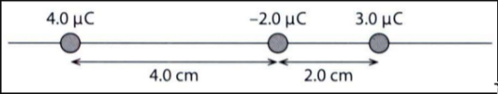

# Term 4

[Slides](https://docs.google.com/presentation/d/1WNhyNvFinqL9Jm8i8uPQu33gopPeHwOOt73iyhptrx8/edit#slide=id.g2ed7bc12787_0_6)

## Newton Law of Gravitation

$F = G \frac{M_1 \cdot M_2}{r^2}$

F is gravitational force
r is distance between to object center to center.
G is a universal gravitational constant ($6.674 \cdot 10^{-11} N m^2 kg^{-2}$)

To apply:
- Point Mass: spherical and of uniform density, one can assume that the entire mass of the body is concentrated at its centre
- Distance is greater than the size of objects

### Learning Check

$F = G \cdot \frac{m^2}{(2 r)^2}$
$F = G \cdot \frac{m^2}{4 r^2}$

$F = G \cdot \frac{m_1 m_2}{4 r^2} + G \cdot \frac{M \cdot m_2}{(2 r)^2}$
$F = \frac{G \cdot m_2}{4 r^2} (m_1 + M)$
Straight to the left.

M/m = 0.75^2 / 0.25^2 = 9.0

### D1. Test Your Understanding

Unless stated otherwise, take the radius and mass of the earth to be 6.4 x 10 6 m and 6.0 x 10 24 kg, respectively.

1. Calculate the gravitational force between:
   1. The earth and the moon (distance between earth and moon = 3.8 x 10 5 km; moon's mass= 7.3 x 10^{22} kg) 
      $F = \frac{G \cdot 6.0 \cdot 10^{24} m \cdot 7.3 \cdot 10^{22} m}{(3.8 \cdot 10^8)^2}$ 
      $F = 2.02438504 \cdot 10^{20} N$ 
      $F = 2.0 \cdot 10^{20} N$
   2. A proton and an electron separated by 10 -10 m (mass of proton = 1.67 X 10 - 27 kg; mass of electron = 9.11 x 10 - 31 kg). 
      $F = \frac{G \cdot 1.67 \cdot 10^{-27} \cdot 9.11 \cdot 10^{-31}}{(10^{-10})^2}$ 
      $F = 1.01536234 \cdot 10^{-47} N$ 
      $F = 1.0 \cdot 10^{-47} N$
2. Stars A and B have the same mass, and the radius of star A is nine times larger than the radius of star B. Calculate the ratio of the gravitational field strength on star A to that on star B. 
   $g = \frac{G \cdot M}{r^2}$ 
   $\frac{\frac{G \cdot M}{(9r)^2}}{\frac{G \cdot M}{r^2}} =$
   $\frac{r^2}{(9r)^2} =$
   $\frac{r^2}{81r^2} =$
   $\frac{1}{81}$
3. Planet A has a mass that is twice as large as the mass of planet B and a radius that is twice as large as the radius of planet B. Calculate the ratio of the gravitational field strength on planet A to that on planet B. 
   $\frac{\frac{G \cdot 2M}{(2r)^2}}{\frac{G \cdot M}{r^2}} =$
   $\frac{2M \cdot r^2}{M \cdot (2r)^2} =$
   $\frac{2 \cdot r^2}{4r^2} =$
   $\frac{2}{4} =$
   $\frac{1}{2}$
4. Stars A and B have the same density, and star A is 27 times more massive than star B. Calculate the ratio of the gravitational field strength on star A to that on star B. 
	 $V_A = \frac{4}{3} \pi R^3$ 
	 $\frac{M_A}{V_A} = \frac{M_B}{V_B}$ 
	 $M_A = 27 M_B$ 
	 $\frac{27 M_B}{\frac{4}{3} \pi R_A^3} = \frac{M_B}{\frac{4}{3} \pi R_B^3}$ 
	 $\frac{27}{R_A^3} = \frac{1}{R_B^3}$ 
	 $\frac{27}{1} = (\frac{R_A}{R_B})^3$ 
	 $3 = \frac{R_A}{R_B}$ 
	 $R_A = 3 R_B$  
	 $\frac{27 M_B}{(3 R_B)^2} = \frac{R_B^2}{M_B}$ 
	 $\frac{27}{9 R_B^3} = R_B^3$ 
	 $\frac{27}{9} =$
	 $\frac{3}{1}$
5. A star explodes and loses half its mass. Its radius becomes half as large. Determine the new gravitational field strength on the surface of the star in terms of the original one. 
   $\frac{G \cdot 0.5 M \cdot r^2}{G \cdot M \cdot (0.5 r)^2} =$
   $\frac{0.5 \cdot r^2}{0.25 r^2} =$
   $2$ 
	 $\therefore g' = 2 g$
6. The mass of the moon is about 81 times less than that of the earth. Estimate the fraction of the distance from the earth to the moon where the gravitational field strength is zero. (Take into account the earth and the moon only.) 
   $\frac{G M_e}{r^2} = \frac{G M_m}{r^2}$ 
   $Mm = \frac{M_e}{81}$ 
   $81 = (\frac{x}{d - x})^2$ 
   $\frac{81 Mm}{x^2} = \frac{Mm}{(d-x)^2}$ 
   $\sqrt{81} = \frac{x}{d - x}$ 
   $9 (d - x) = x$ 
   $9d - 9x = x$ 
   $9d = 10x$ 
   $\frac{9}{10} = \frac{x}{d}$

## Sharing Session with Tharsakara

Banyak Belajar, Lari!!!!!!!!!!!!!!
Di Kelas bener-bener di perhatiin!
Kalau ga paham, belajar sendiri di asrama!
PENTING Baca buku & beneran paham (bagaimana turunannya)!
Pertanyaan-pertanyaan konsep fisika ada di paper.
Belajar materi di depan materi di kelas.
IA kerjain cepet.
SL fokus ke konsep, perlu latihan soal tapi ga sebanyak HL.
For IA and EE of the same subject,
do the same topic!
This'll result in just one experiment for both IA and EE.
Target: before November!
EE must be finished ASAP.
You may copy the best scorer in EE/IA.
Don't do too high level.
MAKE SURE the presentation is the best.

### Physics IA

Physics subject guide,
focus on the criterions that's easy.
Topik pasaran gpp, yang penting ada modifikasi yang original.
IA dicicil secara rata.
Metode; focus on how to do the experiment.
References is important.
Nyontek past IA gpp!!
IA peer review is good,
it makes sure the presentation criteria is very good.
Know yourself: are you more into experiment or theory?
Diagrams are visuals is bonus point for presentation.
Compare your paper to previous works,
it'll be helpful.
Evaluate the things you lack,
it may cover the drawback.
Most importantly,
have fun!

## Kepler's Law of Planetary Motion

Not from calculation, instead it's observation of other observations.
Tycho Brahe, he collect data from the solar system, and he only observe, he sees similarity and makes them into 3 rules.

1. **First Law: Elliptical Orbits** 
   Every planet moves along an ellipse, with the Sun located at one of the two foci (focus of the ellipse). The semi-major axis (average distance from the Sun) and eccentricity (deviation from a perfect angle; $0 < \frac{c}{a} < 1$) define the shape of the orbit. Major axis is the longest whereas minor axis is the shortest.
2. Line joining a planet and the sun sweeps equal areas in equal times. Perihelion (P; closest point in ellipse) and aphelion (A; farthest point in ellipse), with formula $\frac{1}{2} V_A \cdot t \cdot S_A$. Distance is inversely proportional with displacement. 
3. $T^2$ ~ $r^3$ or $T^2$ = $\frac{4 \pi^2 r^3}{G M}$. Revolution of planet is proportional to the $\frac{2}{3}$ of the semi major axis of the ellipse (average of major axis and minor axis).

$b^2 + c^2 = a^2$

Assume $a = 5$ and $b = 4$, thus $c = 3$

How to find foci:

$$\frac{x^2}{a^2} + \frac{y^2}{b^2} = 1$$

$$\frac{y^2}{4^2} = \frac{5^2}{5^2} - \frac{3^2}{5^2}$$

$$y^2 = \frac{16}{25} \cdot 16$$

$$y = \frac{16}{5}$$

$$2a = RF_1 + RF_2$$

$$2a = \sqrt{6^2 + \frac{16}{5}} + RF_2$$

## Orbital Motion

To maintain a constant orbit there must be no frictional forces, so the only force on the particle is the force of gravitation. This force provides the centripetal force on the particle, therefore:

$\frac{m v^2}{r} = \frac{G M m}{r^2}$

...

$T^2 = \frac{4 \pi^2 r^2}{G M}$

$a = \alpha r$ alpha is angular acceleration
$\omega$ is angular velocity

## Learning Check

1. Why are comets such a rare sight?

Comet's eccentricity is very high, whereas earth's eccentricity is very low.
Thus, the probability of seeing them is low.

## D1. TEST YOUR UNDERSTANDING

Unless stated otherwise, take the radius and mass of the earth to be $6.4 \cdot 10^6 m$ and $6.0 \cdot 10^24 kg$, respectively

**1. A satelite orbit the earth above the equator with a period equal to 24 hours.**

**1. b. $T^2 = \frac{4 \pi^2 r^2}{G M}$ **
      $r^2 = \frac{T^2 G M}{4 \pi^2}$ 
      $r^2 = \frac{84600^2 \cdot 6.674 \cdot 10^{-11} \cdot 6.0 \cdot 10^24}{4 \pi^2}$ 
      $r^2 = 29.03878447 s N m^2 kg^{-1}$ 
			$r = 5.388764652 = 5.39$ 
			$r = 4.23 \cdot 10^7$ 
			$h = r - R$
	 c. GPS

2. The Hubble Space Telescope is in the orbit around the earth at a height of 560 km above the earth surface.

2. b. Calculate Hubble's speed. 
      $\frac{m v^2}{r} = \frac{G M m}{r^2}$ 
      $v^2 = \frac{G M}{r}$ 
      $v^2 = \frac{6.674 \cdot 10^{-11} \cdot 6.0 \cdot 10^24}{560000}$ 
			$v = 5.3481639 \cdot 10^{-7} = 5.4 \cdot 10^{-7}$
	 c. In a servicing mission, a space shuttle spotted the Hubble telescope a distance of 10 km ahead. Estimate how long it took the shuttle to catch up with Hubble, assuming that the shuttle was moving in a circular orbit just 500 m below Hubble orbit. 
      $v_s^2 = \frac{6.674 \cdot 10^{-11} \cdot 6.0 \cdot 10^24}{559500}$ 
			$v_s = 5.35055308 \cdot 10^{-7} = 5.4 \cdot 10^{-7}$ 
			$v_h - v_s = 2.38917318 \cdot 10^{-10} km s^{-1}$ 
			$\frac{10000}{v_h - v_s} = 4.2 \cdot 10^{13}$
	    
**7.**

$$g = \frac{G M}{r^2} = \frac{6.67 \times 10^{-11} \cdot 3 \times 10^{22}}{10^9 \sqrt{2}} = 1414.920669 \textrightarrow 2g = 2829.841338$$, upwards

**8.**

$$2 F_1 = F_2$$

$$a_1 = a_2$$

**9.**

$$\frac{1}{4}$$

## Part 2

3. Mercury; smallest radius of orbit, closest distance to the sun.

4. b.

$$F = F_c$$

$$\frac{m_2 v^2}{r} = \frac{G m_1 m_2}{r^2}$$

$$\frac{v^2 r^2}{r G} = m_1$$

$$\frac{G m_1}{\frac{r_1}{r}} = v^2$$

$$\frac{G m_1}{r^{n-1}} = (\frac{2 \pi r}{T})^2$$

$$\frac{G m_1}{r^{n-1}} = \frac{4 \pi^2 r^2}{T^2}$$

$$G m_1 T^2 = 4 \pi^2 r^2 r^{n-1}$$

$$G m_1 T^2 = 4 \pi^2 r^{n+1}$$

$$T^2 \propto r^{n+1}$$

$$T^3 = r^{n+1}$$

$$3 = n + 1 \textrightarrow n = 2$$

5. a. 

5. b. 

$\frac{T^2 M}{r^3}$ is constant = $\frac{4 \pi^2}{G}$

$\frac{T_1^2 M_1}{r_1^3} = \frac{T_2^2 M_2}{r_2^3}$

$$\frac{M_1}{M_2} = \frac{T_2}{T_1}^2 \frac{r_1}{r_2}^3$$

$$(\frac{5.9}{3.6})^2 (\frac{3.5 \times 10^5}{6.7 \times 10^5})^3$$

6. 

$$r = 3.8 \times 10^5, T = 27, R = 6.4 \times 10^3$$

$$R_e = 6.4 \times 10^6$$

$$V_e = \frac{4}{3} \pi R_e^3$$

$$\rho = \frac{M_e}{V_e}$$

$$\rho = \frac{3 M_e}{4 \pi R_e^3}$$

$$T^2 = \frac{4 \pi^2 r^3}{G M_e}$$

$$M_e = \frac{4 \pi^2 r^3}{G T^2}$$

$$M_e = \frac{4 \pi^2 (3.8 \times 10^8)^3}{6.674 \cdot 10^{-11} (2332800)^2}$$

$$\rho = \frac{3 M_e}{4 \pi R_e^3} = 5431.762591 kg m^{-3}$$

**7.**

$$\frac{T_1^2}{r_1^3} = \frac{T_2^2}{r_2^3}$$

$$r_2 = \frac{T_2^2 r_1^3}{T_1^2} = \frac{16 (2.9 \times 10^8)^3}{1.9} = 2.05381053 \times 10^{26}$$

### Learning Check

**6. The solar system is at a distance of about 27,000 light years from the centre of the Milky Way galaxy. A light year is the distance travelled by light in one year. The solar system orbits the galactic centre in a circular orbit with a speed that is roughly $200 km s^{-1}$.**

**The speed of light is 3.0 x 108 m s- 1. Convert a light year into metres**

$$AU = 3.0 \times 10^8 \cdot 31557600.0 = 9.46728 \times 10^{15} m$$

**How long, in years, does it take the solar system to perform one full revolution?**

$$T = \frac{2 \pi \cdot 27000 AU}{2 \times 10^5} = 8.03043107 \times 10^{15}$$

**The mass of the galaxy that attracts our solar system is the mass of the galaxy that is within the orbit radius of the solar system. Estimate this mass.**

$$T^2 = \frac{4 \pi^2 r^3}{G M}$$

$$M = \frac{4 \pi^2 r^3}{G T^2}$$

$$M = \frac{4 \pi^2 (27000 \cdot 9.46728 \times 10^{15})^3}{6.674 \times 10^{-11} (8.03043107 \times 10^{15})^2} = 1.53201414 \times 10^{41}$$

## Electric field

Most of the notes are in Anki.

### Leaning Check

**13. A proton is placed on the positive plate in a parallel plate arrangement and is then released**

**The potential difference between the plates is $120 V$ and the separation of the plates is $2.0 cm$.**

**a. Calculate the electric field strength in between the plates.**

$$E = \frac{V}{d} = \frac{120}{2 \times 10^{-2}} = 6000$$

**b. Calculate the force on the proton.**

$$F = E q = 6000 \cdot 1.6 \times 10^{-19} = 9.6 \times 10^{-16}$$

**c. Determine the gain in kinetic energy of the proton when it reaches the negative plate.**

$$\Delta KE = W = V q = 120 \cdot 1.6 \times 10^{-19} = 1.92 \times 10^{-17}$$

**d. The distance between the plates is doubled but the potential difference remains the same. How do the answers to parts a and b change, if at all?**

Both a and b is halved.
KE is still the same though.

### Test Your Understanding

**1. A charged conducting sphere with charge $$+12 µC$$ is allowed to touch an identical conducting sphere of charge $$-6 µC$$. The spheres are then separated. What is the charge on each sphere after separation?**

$$\frac{12 + (-6)}{2} = 3 µC$$

**2. The electroscope is a device consisting of a metal sphere, a metallic rod connected to the sphere and two light metallic leaves attached to the rod. When charge is deposited on the sphere, rod and leaves, the leaves repel as shown. The whole arrangement (see Figure) is protected within a glass jar. Suppose the charge on the electroscope is positive. A negatively charged rod is put close but not touching the sphere of the electroscope. What will happen to the leaves?**

The leaves will start to close as the proton move from the leaves and rod to the metal sphere due to the attraction in the metal sphere.

**3. An electroscope is neutral. The following process takes place:**
**a. a positively charged rod is placed close but not touching the sphere of the electroscope 
b. the sphere is earthed 
c. the earthing is removed with the charged rod still in place 
d. the rod is removed far away.**

**At each stage draw a diagram to represent the state of the electroscope.**

**4. a. Calculate the force between charges $q_1$ of $2.0 µC$ and $q_2$ of $4.0 µC$ separated by $r = 5.0 cm$.**

$$F = 8.99\times10^{-12} \frac{2.0\times10^{-6} \cdot 4.0\times10^{-6}}{5\times10^{-2}} = 2.8768\times10^{-20} N$$

**4. b. Let the force calculated in a be $F$. In terms of $F$ and without further calculations, state the force between these charges when:**

**i. the separation $r$ of the charges is doubled**

$$\frac{f}{4}$$

**ii. $q_1$ and $r$ are both double**

$$\frac{f}{2}$$

**iii. $q_1$, $q_2$ and $r$ are all doubled**

$$F$$

**5. Three charges are placed on a straight line as shown in Figure below. Calculate the net force on the middle charge.**

$$\Sigma F = -F_1 + F_2$$

$$\begin{align*}
-F_1 + F_2 \\
-8.99\times10^{9} \frac{-2.0\times10^{-6} 4.0\times10^{-6}}{(4.0\times10^{-2})^2} + 8.99\times10^{9} \frac{-2.0\times10^{-6} 3.0\times10^{-6}}{(2.0\times10^{-2})^2} \\
-44.95 + (-134.85) \\
-89.9 N
\end{align*}$$

**6. In the previous question (no 5), determine the position of the middle charge so that it is in equilibrium.**

Assuming only the middle charge move, $r_1 + r_2 = 6.0 cm$

$$\begin{align*}
\Sigma F &= 0 \\
\Sigma F &= F_2 - F_1  \\
0 &= F_2 - F_1  \\
F_1 &= F_2 \\
k \frac{-2.0\times10^{-6} \cdot 4.0\times10^{-6}}{r_1^2} &= k \frac{-2.0\times10^{-6} \cdot 3.0\times10^{-6}}{r_2^2} \\
\frac{4.0\times10^{-6}}{r_1^2} &= \frac{3.0\times10^{-6}}{r_2^2} \\
4 r_2^2 &= 3 r_1^2
\end{align*}$$

$$r_1 + r_2 = 6.0 cm, 4 r_2^2 = 3 r_1^2\;\textrightarrow\;r_1 = 3.2 cm, r_2 = 2.8 cm$$

**7. Calculate the force (magnitude and direction) on the charge $q$ in Figure below, where $q = 3.0 µC$.**

$$\begin{align*}
k &= 8.99\times10^9 \\
F_1 &= k \frac{3\times10^{-6} -3\times10^{-6}}{(3\times10^{-2})^2} \\
F_2 &= k \frac{3\times10^{-6} 6\times10^{-6}}{(5\times10^{-2})^2} \\
F_x &= F_{2x} \\
F_x &= k \frac{q 2q}{(5\times10^{-2})^2} \\
F_y &= F_1 - F_y \frac{3}{5} \\
F_y &= 90 - 38.8 \\
F_y &= 51.1 N \\
m &= \sqrt{F_x^2 + F_y^2} \\
m &= \sqrt{51.84^2 + 51.1^2} \\
m &= 72.8 N \\
\theta &= tan^{-1} (\frac{51.1}{51.8}) \\
\theta &= 44.6 \degree \\
\text{In IB, }\theta\text{is measured anti-clockwise from the positive X axis} \\
\therefore \theta &= 44.6 + 180 = 224.6 \degree
\end{align*}$$

**9. Figure below shows two spherical charges that are fixed in place. The spheres have the same radius.**

**Explain :**

**a. In which region, I, II or Ill, could the electric field be zero?**

Region I may be zero, because force from $q$ and $-2q$ has the possibility to cancel out.
The relative magnitude of $-2q$ to $q$ counteract the fact that $q$ is closer to $-2q$.

$$E_{net}(I) = 0 = k \frac{q}{r_1^2} - k \frac{2q}{r_2^2} \textrightarrow r_2 = \sqrt{2} r_1, r_2 > r_1$$

**b. In which region, I, II or Ill, does the electric field attain its maximum magnitude?**

At region II, because the force from $q$ and $-2q$ would act on the charge with the same direction.

**10. Four charges, each of magnitude q, are fixed at the vertices of a square of side a, as shown in Figure below.**

**a. What is the direction of the electric field at the centre of the square?**

To the left.
The Y components of each force cancel out each other, $\Sigma F_y = 0$.

**b. What is the magnitude of the field in a?**

$$4 cos 45 k \frac{q}{r^2}$$

**11. Two plastic spheres each of mass $100.0 mg$ are suspended from very fine insulating strings of length $85.0 cm$, as shown in Figure below. When equal positive charges are placed on the spheres, the spheres repel and are in equilibrium when $10.0 cm$ apart.**

**a. Determine the charge on each sphere.**

$$\begin{align*}
r &= 0.1 m \\
k \frac{q^2}{(0.1)^2} \\
q &= \sqrt{\frac{0.1^2}{8.99\times10^{9}}} \\
q &= 1.05467865\times10^{-6}
\end{align*}$$

**15. The formula for the radius of the oil drop derived in the text (Tsokos’ book) ignores the buoyant force on the oil drop. Show that if this force is taken into account the radius is given by**

$$r = \sqrt{\frac{9 \eta v}{2 (\rho - \rho_{air}) g}}$$

$$F_B = \rho_{air}\,g V_{oil},W = F_{drag\,down}$$

$$F_g = \frac{4}{3}\pi r^3 \rho g$$

$$V = $$

$$\begin{align*}
\sigma F = F_B + F_{drag\,down} - W &= 0 \\
F_B + F_{drag\,down} &= W \\
\rho_{air}\,g \frac{4}{3} \pi r_{oil}^3 + \rho_{air}\,g \frac{4}{3} \pi r_{oil}^3 &= \rho_{oil}\,\frac{4}{3} \pi r_{oil}^3\,g \\
\rho_{air}\,g \frac{4}{3} \pi r_{oil}^3 &= \rho_{oil}\,\frac{4}{3} \pi r_{oil}^3\,g - \rho_{air}\,g \frac{4}{3} \pi r_{oil}^3 \\
3 \eta v &= \frac{2}{3} r^2 g (\rho_{oil} - \rho_{air}) \\
r &= \sqrt{\frac{9 \eta v}{2 (\rho - \rho_{air}) g}}
\end{align*}$$

**17. Explain why it is reasonable to assume that the masses of the coin bags described above $84 g$, $63 g$, $98 g$, $35 g$, $56 g$ and $42 g$ lead to the conclusion that the mass of each coin is $7 g$.**

Because the greatest common divisor is 7 g, thus all given mass are a multiple of 7 g.

$$\begin{align*}
84g = 2^2 \cdot 3 \cdot 7 &= 7 * 12 \\
63g = 3^2 \cdot 7 &= 7 * 9 \\
98g = 2 \cdot 7^2 &= 7 * 14 \\
35g &= 7 * 5 \\
56g = 2^3 \cdot 7 &= 7 * 8 \\
42g = 2 \cdot 3 \cdot 7 &= 7 * 6
\end{align*}$$

### The Millikan Oil Drop Experiment

Between 1910 and 1911.

Voltage can be controlled from 0 to whatever.
The oil is dripping down bit by bit.

<!-- TODO:--->

On zero potential difference, you have the formula:

$$F_{drag\~down} = m_{oil} g = \rho_{oil}^2 V_{oil} g = \rho_{oil}^2 \frac{4}{3} \pi r_{oil}^3 g = 6 \pi \eta_{air} r_{oil} v_{oil}$$

$F_{drag\~down}$ is opposite to (falling) movement. $\eta$ is viscosity, $r$ is radius of oil, and $v$ is terminal velocity (it's so small that it reach terminal velocity, that's why you need microscope)

$\sigma F_y = 0$. -> $r_{oil}^2 = \frac{g m v}{2 \rho_oil g}$

$$F = m a = P A = p g h A = p g V$$

- F = Force
- p = density
- g = gravity
- h = height
- A = area
- V = volume

NOW, Oil drops that were charged by X-rays were allowed to enter a region of uniform electric field between the parallel plates.
electron and neutron will be split, so it can go to the oil, and makes it negatively charged;
when the electron is stationary (because of F coulomb), by adjusting V.

$$E q = _{oil} g \textrightarrow q = \frac{m_{oil} g}{E} \textrightarrow q = \frac{m_{oil} g d}{V_{balance}}$$

# Magnetic Field and Force

Magnetic fields are produced around all moving charges (currents).
The Earth’s magnetic field is also thought to be created by currents in the Earth’s molten iron and nickel core.
The North geomagnetic pole actually represents the South pole of Earth’s magnetic field because opposite magnetic poles attract.
Compasses point in the direction of field lines. The North end of a magnet, points toward Earth’s South magnetic field.
The end closer to the geographic north is called the north (seeking) pole, the other end is called the south (seeking) pole.
The strength of the field is shown by the density of the field lines.
The field lines never cross.

The vector representing a magnetic field is called magnetic flux density and its symbol is B. 
Its unit is the tesla, T.
In materials called ferromagnetic these tiny field s a re aligned so that a large observable macroscopic magnetic field is produced . 
We can not isolated north and south poles, so  no magnetic monopole has ever been found. 
We can isolate charges, it is explain why electric charge is quantised.
The strength of a field is related to the density of field lines. This tells us that the magnetic field is strongest close to the poles.

Small magnetic compasses around a long straight wire that carries current upwards. 
The magnetic field is tangent to this circle.

The right-hand grip rule for the magnetic field around a straight current-carrying wire:

- The thumb is in the direction of the current.  Using the conventional current I (i.e. the direction that positive charges are moving in the wire)
- The fingers curl in the direction of the magnetic field. 
- The magnetic flux density (B) is the quantity that is used to measure how strong the field is.

When a current-carrying wire is made into a circular loop the field inside is due to the addition of all the field components around the loop, making the field at the centre greater. 
Adding more loops to form a coil will increase the field.
A solenoid is a special type of coil where the loops are wound next to each other along a cylinder to form a helix.

A different right-hand grip rule gives the direction of the magnetic field for a solenoid:

- The fingers curl in the direction of the current.
- The thumb points in the direction of the magnetic field or north pole.

An electric charge moving in a region of magnetic field experiences a new type of force called a magnetic force.
A charge q moving with speed v in a region of magnetic field of magnetic flux density B will experience a magnetic force F given by: 

$$\begin{align*}
F &= q v \times B \\
F &= q v B sin \theta \\
F &= q v B \text{ for } \theta = 90 \degree \\
B &= \frac{F}{q v} \\
/Phi &= B \cdot A \\
\\
B = \text{magnetic field strength} (T) \\
Φ = \text{the number of flux or magnetic lines} (Wb) \\
1 Wb (\text{weber}) = 1 Vs (\text{volt.second}) \\
1T (\text{tesla}) = 1 Wb.m^{-2} or kg s^{-2} A^{-1} \\
A = \text{area} (m^2) \\
F = \text{magnetic force} (N) \\
I = \text{current} (A) \\
L = \text{length of wire} (m) \\
q = \text{charge} (C) \\
v = \text{speed of charge or drift speed} (ms1) \\
\theta = \text{the angle between current direction and field lines}
\end{align*}$$

If the velocity of the charge is parallel to the direction of the field, the magnetic force is zero
A magnetic flux density of I T produces a force of 1 N on a charge of 1 C moving at 1 m s- 1 at right angles to the direction of the field . 
There are “Fleming hand’s rules” to help us find this direction

#### Fleming Hand Rules

The right-hand rule gives the direction of the force on a positive charge / conventional current.
The left-hand rule gives the direction of the force on a negative charge / electron. 
Figure a
Four fingers point in the direction of the field
The thumb in the direction of the velocity. 
The direction away from the palm is the direction of the force.
Figure b
The middle finger now represents the force
the index finger represents the field
the thumb represents the velocity. 
Figure c
Curl the right-hand fingers so that they rotate from the vector v to the vector B 
The direction of the thumb is the direction of the force. 

#### Learning Check

**21. Four long straight wire are placed perpendicular to the plane of the paper at the edges of a square. The same current is in each wire in the direction shown in the diagram. Deduce the direction of the magnetic field at point P in the centre of the square.**

The wires above has its magnetic field direction is clockwise, whereas the wires below has its magnetic field direction anti-clockwise.

**22. Express the tesla in terms of fundamental units.**

$$\begin{align*}
F &= q v \times B \\
kg m s^{-2} = C m s^{-1} T \\
T = \frac{kg}{C s}
correct: kg s^{-2} A^{-1}
\end{align*}$$

# Motion in Electric Field

The path of an electric charge in a uniform electric field is either a straight line or a parabolic path:
Straight-line path: Occurs if the charge is initially at rest or if its initial velocity is parallel to the electric field.
The particle will experience a force qE in the direction of the field (A negative charge would move in the opposite direction)
It will move along a straight line with acceleration:

The positive charge increases its kinetic energy as it moves to the right. 
The gain in kinetic energy from X to Y is equal to the work done by the electric force, and that is qV. 

## Parabolic path

A more interesting case is when the charge enters a region of uniform electric field with an initial velocity $u$ that is at right angles to the electric field.

1. the particle will follow a parabolic path
2. the role of the acceleration of gravity is played by the acceleration $a = \frac{q E}{m}$
3. the component of velocity normal to the field will remain constant : $v_x = u$
4. the component of velocity parallel to the field will increase uniformly: $v_y = u_y + at = \frac{q E}{m} t$

## Kinetic Energy

The kinetic energy of the particle increases as time goes on because the electric force is doing work on the particle. 

1. After time $t$, the particle will move a horizontal distance 
$x = ut$
2. Vertical distance: $y = \frac{1}{2} a t^2 = \frac{1}{2} \frac{q E}{m} t^2$
3. Kinetic Energy

$$\begin{align*}
Ek = \frac{1}{2} m v^2 = \frac{1}{2} m (x_x^2 + v_y^2) \\
EK = \frac{1}{2} m u^2 + \frac{1}{2} m (\frac{q E t}{m})^2 \\
Ek_f = Ek_i + \frac{1}{2} \frac{(q E t)^2}{m} \\
\Delta Ek = Ek_f - Ek_i \\
\Delta Ek = \frac{1}{2} \frac{m E^2 q^2 t^2}{m^2} \\
\Delta Ek = E q \frac{1}{2} \frac{q E}{m} t^2 \\
\text{substitute with y and F} \\
W = \Delta Ek = F y
\end{align*}$$

4. the change in kinetic energy is the work done by the electric force.

#### Leaning Check

**1. A proton and an alpha ($^2_4He$) particle (mass $4m_P$, charge $+2e$) are placed on the positive plate inside a parallel plate arrangement, as shown in Figure. The particles are released at the same time. Which particle will reach the negative plate first?**

$$a = \frac{E q}{m} \\
a_p = \frac{E e}{m} \\
a_{\alpha} = \frac{E 2e}{4m} \\
\frac{a_p}{a_{\aplha}} = \frac{1}{2} \\
\therefore proton$$

**2. A potential difference of 120 V is established between two oppositely charged parallel plates. A proton is placed on the positive plate and is then released, as shown in Figure. What is the speed of the proton as it hits the negatively charged plate?**

$$/begin{align*}
W = \Delta E k \\
q V = \frac{1}{2} m v^2 \\
v = \sqrt{\frac{2 q V}{m}} \\
v = \sqrt{\frac{2 \cdot 1.60\times10^{-19} \cdot 120}{1.67\times10^{-27}}} \\
v = 151637.7657 \approx 1.52\times10^{5} m s^{-1}
/end{align*}$$

**3. An electron moving at speed $6.0 \times 10^6 m s^{-1}$ enters two oppositely charged parallel plates at a point near the lower plate, as shown in Figure. The length of the plates is $12 cm$, and their separation is $4.8 cm$. There is a potential difference of $60 V$ between the plates. The upper plate is positively charged. 

 <!-- TODO:-->

**a. Determine:**
**i. the magnitude and direction of the electric field in between the plates**

$$/begin{align*}
\text{Direction: downward} \\
E = \frac{V}{d} = \frac{60}{4.8\times10^{-2}} \\
E = 1250 V m^{-1}
/end{align*}$$

**ii. the magnitude and direction of the acceleration of the electron when inside the region of electric field.**

$$/begin{align*}
\text{Direction: upwards} \\
a = \frac{E q}{m} \\
a = \frac{1250 \cdot 1.6\times10^{19}}{9.1\times10^{-31}} \\
a = 2.1978022\times10^{14} \approx 2.20\times10^{14} m s^{-2}
/end{align*}$$

**b. Suggest whether the electron will hit the upper plate or not.**

Yes, because the x-axis ($6.0 \times 10^6 m s^{-1}$) component is way lesser than the acceleration on the y-axis ($$), and the length of the plates is only $1.2\times10^{-1} m$

$$/begin{align*}
y = \frac{1}{2} a t^2 \\
y = \frac{1}{2} 2.20\times10^{14} \cdot 2\times10^{-8} \\
y = 2200000 m \\
\therefore \text{won't collide}
/end{align*}$$

#### Parabolic Path

$$/begin{align*}
v_x &= v cos \theta \\
v_x &= 6.0\times10^6 cos 30 \\
v_x &= 5196152.423 m s^{-1}
v_y &= 3000000 m s^{-1} \\
\\
a &= \frac{q E}{m} \\
a &= \frac{1.6\times10^{-19} \frac{60\times10^3}{4.8\times10^{-2}}}{1.67\times10^{-27}} \\
a &= 1.19760479\times10^{14} m s^{-2} \approx 1.2\times10^{14} m s^{-2} \\
\\
v_y^2 &= u_y^2 + 2 a s \\
0 &= (3.0\times10^6)^2 - 2 \cdot 1.2\times10^{14} y \\
y &= \frac{-(3.0\times10^6)^2}{-2 \cdot 1.2\times10^{14}} \\
y &= 0.0375 m \\
\therefore \text{don't hit}
/end{align*}$$

#### Learning Check

**Continue from question 3**

**4. The length of the plates in Figure is $22 cm$. Figure shows the proton at its highest point. Calculate:**

**a. the horizontal distance covered by the proton when it is at its highest point**

$$/begin{align*}
0 = u sin 30 + a t \\
t = \frac{u sin 30}{a} \\
t = \frac{6.0\times10^6 sin 30}{1.2\times10^{14}} \\
t = 2.5\times10^{-8} \\
\\
x = u_x t \\
x = 6.0\times10^6 cos(30) \cdot 2.5\times10^{-8} \\
x = 0.13 m
/end{align*}$$

**b. the horizontal distance covered by the proton when it is at its highest point**

$$/begin{align*}
W = \Delta Ek \\
W = Ek_f - Ek_i \\
W = \frac{1}{2} m v_y^2 - \frac{1}{2} m u_y^2 \\
W = 0 - \frac{1}{2} 1.67\times10^{-27} (3.0\times10^6)^2 \\
W = 7.515\times10^{-15}
/end{align*}$$

$R = \frac{m v}{q B}$

$$v = \frac{2 \pi r}{T} = \Omega r = \frac{2 \pi R}{T}$$
$$\begin{align*}
T = \frac{2 \pi m}{q B} \\
W = F y
\end{align*}$$

normal = right angle = perpendicular.
circular movement.
velocity change, but not speed.
no work (W) while in the region of the magnetic field, Ek final and Ek initial doesn't change.

$$\begin{align*}
W = F r \\
W = F r cos \theta \\
W = F r cos 90 \degree \\
W = 0
\end{align*}$$

$$\begin{align*}
\end{align*}$$

## Motion in crossed electric and magnetic field 

Gabungan perpendicular: 2 forces: electric and magnetic.
Search resultant vector of bot ofrces.
e.g. positive change right go in electric field that's going down.
-> v goes down cuz electron is there, $F_{\text{electric}}$ ($qE$) to down , $F_{\text{magnetic}}$ ($q v B$) to up.

q: when it's electron: the two forces are swapped.

## Test your understanding

**1. Why can't a charged particle follow a circular path in a uniform electric field?**

Because the force doesn't point to the center of the circle of the electric field.

**2. Two parallel plates are oppositely charged. An electron is positioned on the negative plate and a proton on the positive plate.The particles are released. Compare, for when the particles reach the opposite plate: the kinetic energy, the speed, the time to move across.**

$$\begin{align*}
W_p == W_e \\
q = -q, \text{only magnitude} \\
V \text{(voltage)} == \\
\\
\frac{1}{2} m_e v_e^2 = \frac{1}{2} m_p v_p^2 \\
9.11\times10^{-31} v_e^2 = 1.67\times10^{-27} v_p^2 \\
v_e \approx 43 v_p \\
\\
\frac{v - u}{a} = t \\
m a = E q \\
a = \frac{E q}{m} \\
v = \frac{q E}{m} t \\
\frac{v m}{q E} = t \\
\frac{v m}{ E} = t_e \\
43 = \frac{t_e}{t_p} \frac{m_p}{m_e} \\
43 \frac{m_e}{m_p} = \frac{t_e}{t_p} \frac{m_p}{m_e} \\
\frac{t_e}{t_p}= 0.02345688623 \\
t_p = 42.6 t_e \\
\therefore t_p > t_e
\end{align*}$$

**3. Two parallel plates are oppositely charged. A proton (charge +e, mass m) and an alpha particle (charge +2e, mass 4m) are placed on the positively charged plate. When the particles reach the opposite plate, what is the ratio of: the proton speed to the alpha particle speed, time of travel of the proton to time of travel of the alpha particle?**

$$\begin{align*}
\frac{v_p}{v_d} &= \frac{q_p m_a}{m_p q_a} = 8 \\
v &= \sqrt{\frac{2 V q}{m}} \\
\frac{v_p}{v_a} &= \sqrt{\frac{q_p m_a}{m_p q_a}} \\
\frac{v_p}{v_a} &= \sqrt{2} \\
v_p &= \sqrt{2} v_a \\
\\
v &= \frac{q E}{m} t \\
t &= \frac{m v}{q E} \\
\frac{t_p}{t_a} &= \frac{m_p v_p q_a}{q_p m_a v_a} \\
\frac{t_p}{t_a} &= \frac{m_p \sqrt{2} q_a}{q_p m_a} \\
\frac{t_p}{t_a} &= 0.7071067812 \\
\end{align*}$$

**4. A proton is injected with speed $1.8\times10^5 m s{-1}$ into the region between two oppositely charged parallel plates. The top plate is the negative plate, and there is a potential difference of $60 V$ between the plates. The plates are $8.0 cm$ apart and $24 cm$ long.  How far above the positive plate will the proton be when it leaves the plates?**

$$\begin{align*}
F &= \frac{E q}{m} \\
F &= \frac{E q}{(1.67\times10^{-27})^2} \\
F &= \frac{60 \cdot 1.6\times10^{-19}}{(8\times10^{-2} 1.67\times10^{-27})^2} \\
F &= 5.37846463\times10^{38} \\
a &= \frac{q E}{m} \\
a &= \frac{q V}{m d} \\
a &= 7.18562874\times10^{10} \\
s &= u_y t + \frac{1}{2} a t^2 \\
t &= \frac{24\times10^{-2}}{1.8\times10^5} = 1.33333333\times10^{-6} \\
s &= 0 + 0.127744511 m
\end{align*}$$

**5. A proton is injected into the region between two oppositely charged parallel plates. The top plate is the positive plate, and there is a potential difference of $150 V$ between the plates. The plates are $4.0 cm$ apart. The velocity of the proton makes an angle of $30°$ with the horizontal.**

$$\begin{align*}
\end{align*}$$

##  Physics SLP

**1. An investigation was undertaken to determine the relationship between the length of a pendulum $l$ and the time taken for the pendulum to oscillate twenty times. The time it takes to complete one swing back and forth is called the period $T$. It can be shown that $T = 2 \pi \sqrt{\frac{l}{g}}$ where $g$ is the acceleration due to gravity. The data in the table below was obtained.**

| Length of pendulum $\pm 0.05 m$ | Time for 20 oscilations $\pm 0.2 s$ | Period $T$ | $T^2$ | Absolute error of $T^2$ |
| --- | --- | --- | --- | --- |
| 0.21 | 18.1 |  |  |  |
| 0.40 | 25.5 |  |  |  |
| 0.62 | 31.5 |  |  |  |
| 0.80 | 36.8 |  |  |  |
| 1.00 | 40.4 |  |  |  |

**a. Copy the table and complete the period column for the measurements. Be sure to give the uncertainty and the units of T.**

**b. Calculate the various values for $T^2$ including its units.**

**c.Determine the absolute error of $T^2$ for each value.**

| Length of pendulum $\pm 0.05 m$ | Time for 20 oscilations $\pm 0.2 s$ | Period $T$ | $T^2$ | Absolute error of $T^2$ |
| --- | --- | --- | --- | --- |
| 0.21 | 18.1 | $0.905 \pm 0.01$ | 0.819 | 0.552 |
| 0.40 | 25.5 | $1.275 \pm 0.01$ | 1.626 | 0.392 |
| 0.62 | 31.5 | $1.575 \pm 0.01$ | 2.481 | 0.317 |
| 0.80 | 36.8 | $1.84 \pm 0.01$ | 3.386 | 0.272 |
| 1.00 | 40.4 | $2.02 \pm 0.01$ | 4.080 | 0.248 |

**d. Draw a graph of T2 against l. Make sure that you choose an appropriate scale to use as much of a piece of graph paper as possible. Label the axes, put a heading on the graph, and use error bars. Draw the curve of best fit.**

**e. What is the relationship that exists between $T^2$ and $l$?**

$$\text{Perpendicular}$$

**f. Are there any outliers?**

$$\text{}$$

**g. From the graph determine a value for $g$**

$$\begin{align*}
T = 2 \pi \sqrt{\frac{l}{g}} \\
\frac{T}{2 \pi} = \sqrt{\frac{l}{g}} \\
\frac{T^2}{4 \pi^2} = \frac{l}{g} \\
g = \frac{4 pi^2}{l T^2} \\
\text{from the data}, g \approx
\end{align*}$$
[0.21, 0.40, 0.62, 0.80, 1.00]

## Phase Difference

$\delta \phi$

$$\begin{align*}
\Delta \phi = \frac{\Delta t}{T} \times 2 \pi \text{(in radians)} \\
\\
\frac{0.25}{2} \times 2 \pi \\
\frac{\pi}{4} \\
45 \degree\\
\end{align*}\delta$$

# Differential

$$\begin{align*}
a = \frac{\Delta v}{\Delta t} = \frac{d v}{d t} \\
= \frac{d^2 x}{d t^2} \\
\text{if not constant:} \\
J = \frac{d^3 x}{d t^3} \\
\\
y = n t^x \\
\frac{d y}{d t} = n x t^{x-1} \\
y = 2 t^3 = \frac{d y}{d t} = 2 \cdot 3 t^2 = 6 t^2 \\
\text{now differentiate that!} \\
\frac{d^2 y}{d t^2} = 6 \cdot 2 t^{2-1} = 12 t \\
\frac{d^3 y}{d t^3} = 12 \cdot 1 t^{1-1} = 12 \\
\frac{d^4 y}{d t^3} = 12 \cdot 0 t^{0-1} = 0 \\
\\
y = 14 t^3 + 2 t^2 + 15 t + 1 \\
\frac{d y}{d t} = 14 \cdot 3 t^2 + 2 \cdot 2 t^1 + 15 = 42 t^2 + 4 t + 15 \\
\\
s = u t + \frac{1}{2} a t^2 \\
v = \frac{d s}{d t} = u \cdot 1 t^0 + \frac{a}{2} \cdot 2 t^1 \\
v = u + a t \\
\\
\text{once more,} \\
y = 4 t^{\frac{1}{2}} \\
\frac{d y}{d t} = 4 \cdot \frac{1}{2} t^{\frac{1}{2} - 1} \\
= 2 t^{-\frac{1}{2}} \\
= \frac{2}{\sqrt{t}} \\
\\
y = x^{-1} \\
\frac{d y}{d t} = 1 \cdot -1 x^{-2} \\
= -x^{-2} \\
\\
y = sin \theta \\
\frac{d y}{d t} = cos \theta \\
\text{because } sin \textrightarrow cos \textrightarrow -sin \textrightarrow -cos \\
\\
y = sin (\omega t) \\
\frac{d y}{d \omega t} = cos \omega t \\
\frac{d y}{d t} = cos \omega 1 t^0 \\
\text{we make parables: } m = \omega t \\
= \frac{d y}{d t} \frac{d m}{d m} \\
= \frac{d y}{d m} \frac{d m}{d t} \text{(computative)} \\
= \frac{d sin m}{d m} \cdot \frac{d \omega t}{d t} \\
= cos m \cdot \omega \\
= \omega cos \omega t
\end{align*}$$
